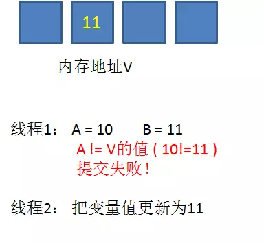
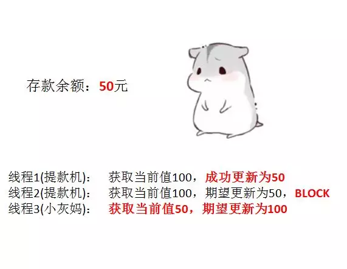

## 什么是CAS？
> CAS：Compare And Swap的缩写，比较并替换，CAS机制中有3个基本操作数，分别是：**内存地址V**、**旧的预期值A**、**要修改的新值B**。**<font color=red>更新一个变量的时候，只有当变量的预期值A和内存地址V中的实际值相同时，才会将内存地址V中对应的值修改为B</font>**

上述或许有些抽象，我们看个例子：  

1. 在内存地址V当中，存储着值10的变量


2. 此时**线程1**想要把变量值加1，对线程1来说，旧的预期值A=10，要修改的新值B=11


3. **线程1**要提交更新之前，另外一个**线程2**抢先一步，把内存地址V中的变量值率先更新成了11


4. **线程1**开始提交更新，首先进行**旧的预期值A和内存地址V中的实际值进行比较(Compare)**，发现 A != V中的实际值，提交失败。



5. **线程1**重新获取**内存地址V中的当前值**，并重新计算想要修改的新值。此时对**线程1**来说，A=11，B=12。这个重新尝试的过程被称为**“自旋”**


6. 这一次比较幸运，没有其他线程改变**内存地址V中的值**，**线程1**进行Compare，发现**旧的预期值A 和 内存地址V中的实际值**是相等的。


7. **线程1**进行SWAP，把**内存地址V中的值**替换成**要修改的新值B**，也就是12


&emsp; 从思想上来说，Synchronized属于**“悲观锁”**，悲观的认为程序中的并发情况严重，所以严防死守。CAS属于**“乐观锁”**，乐观的认为程序中的并发情况不那么严重，所以让线程不断的去尝试更新。

## CAS机制的缺点 ##
1. CPU开销较大

> 在并发量比较高的情况下，如果多线程反复尝试更新某一个变量，却一直更新不成功，循环往复，会给CPU带来很大的压力。

2. 不能保证代码块的原子性

> CAS机制所保证的只有一个变量的原子性操作，而不保证整个代码块的原子性。比如需要保证3个变量功能进行原子性的更新，就不得不使用synchronized了。
3. ABA问题

> 这是CAS机制最大的问题所在，**什么是ABA问题？**

## 什么是ABA问题？
1. 假设内存中有一个值为A的变量，存储在地址V当中。


2. 此时有三个线程想使用CAS的方式更新这个变量值，每个线程的执行时间有略微的偏差。**线程1**和**线程2**已经获得当前值，**线程3**还未获得当前值。


3. 接下来，**线程1**先一步执行成功，把当前值成功从**A**更新为**B**；同时**线程2**因为某种原因被阻塞住，没有做更新操作；**线程3**在**线程1**更新之后，获得了**当前值B**。


4. 再之后，**线程2**仍然处于阻塞状态，**线程3**继续执行，成功把**当前值**从**B**更新成了**A**。


5. 最后，**线程2**终于恢复了运行状态，由于阻塞之前已经获得了**“当前值”A**，并且经过compare检测，**内存地址V中的实际值也是A**，所以成功把**变量值A**更新成了**B**。


在整个过程中，**线程2**获取到的**变量值A**是一个**旧值**，尽管和当前的实际值相同，但**内存地址V中的变量**已经经历了**A->B->A**的改变。


当我们举一个提款机的例子。假设有一个遵循CAS原理的提款机，小灰有100元存款，要用这个提款机来提款50元。


由于提款机硬件出了点小问题，小灰的提款操作被同时提交两次，开启了两个线程，两个线程都是获取当前值100元，要更新成50元。

理想情况下，应该一个线程更新成功，另一个线程更新失败，小灰的存款只被扣一次。


**线程1**首先执行成功，把余额从100改成50。**线程2**因为某种原因阻塞了。这时候，小灰的妈妈刚好给小灰**汇款**50元。



**线程2**仍然是阻塞状态，**线程3**执行成功，把余额从50改成100。


**线程2**恢复运行，由于阻塞之前已经获得了**“当前值”100**，并且经过compare检测，此时存款实际值也是100，所以成功把变量值100更新成了50


原本**线程2**应当提交失败，小灰的正确余额应该保持为100元，结果由于ABA问题提交成功了。

什么意思呢？真正要做到严谨的CAS机制，我们在Compare阶段不仅要比较期望值A和地址V中的实际值，还要比较变量的版本号是否一致。

我们仍然以最初的例子来说明一下，假设地址V中存储着变量值A，**当前版本号是01**。线程1获得了当前值A和版本号01，想要更新为B，但是被阻塞了。


这时候，内存地址V中的变量发生了多次改变，**版本号提升为03**，但是变量值仍然是A。


在Java当中，**AtomicStampedReference**类就实现了用版本号做比较的CAS机制。

## CAS底层实现原理

首先看一看**AtomicInteger**当中常用的自增方法 **incrementAndGet**：
```
public final int incrementAndGet() {
    for (;;) {
        int current = get();
        int next = current + 1;
        if (compareAndSet(current, next))
            return next;
    }
}
private volatile int value;
public final int get() {
    return value;
}
```
这段代码是一个无限循环，也就是CAS的**自旋**。循环体当中做了三件事：

- 获取当前值。
- 当前值+1，计算出目标值。
- 进行CAS操作，如果成功则跳出循环，如果失败则重复上述步骤。

这里需要注意的重点是 **get方法**，这个方法的作用是**获取变量的当前值**。

如何保证获得的当前值是内存中的最新值呢？很简单，用**volatile关键字**来保证.

接下来看一看**compareAndSet方法**的实现，以及方法所依赖对象的来历：
```
private static final Unsafe unsafe = Unsafe.getUnsafe();
private static final long valueOffset;

static {
    try {
        valueOffset = unsafe.objectFieldOffset
            (AtomicInteger.class.getDeclaredField("value"));
    } catch (Exception ex) { throw new Error(ex); }
}

/**
 * Atomically sets the value to the given updated value
 * if the current value {@code ==} the expected value.
 *
 * @param expect the expected value
 * @param update the new value
 * @return {@code true} if successful. False return indicates that
 * the actual value was not equal to the expected value.
 */
public final boolean compareAndSet(int expect, int update) {
    return unsafe.compareAndSwapInt(this, valueOffset, expect, update);
}
```
compareAndSet方法的实现很简单，只有一行代码。这里涉及到两个重要的对象，一个是unsafe，一个是valueOffset。

什么是unsafe呢？Java语言不像C，C++那样可以直接访问底层操作系统，但是JVM为我们提供了一个后门，这个后门就是unsafe。unsafe为我们提供了**硬件级别的原子操作**。

至于valueOffset对象，是通过unsafe.objectFieldOffset方法得到，所代表的是AtomicInteger**对象value成员变量在内存中的偏移量**。我们可以简单地把valueOffset理解为value变量的内存地址。

CAS机制当中使用了3个基本操作数：内存地址V，旧的预期值A，要修改的新值B。

而unsafe的compareAndSwapInt方法参数包括了这三个基本元素：valueOffset参数代表了V，expect参数代表了A，update参数代表了B。

正是unsafe的compareAndSwapInt方法保证了Compare和Swap操作之间的原子性操作。

## 转载至
[http://www.itsoku.com/article/63](http://www.itsoku.com/article/63)

[http://www.itsoku.com/article/64](http://www.itsoku.com/article/64)