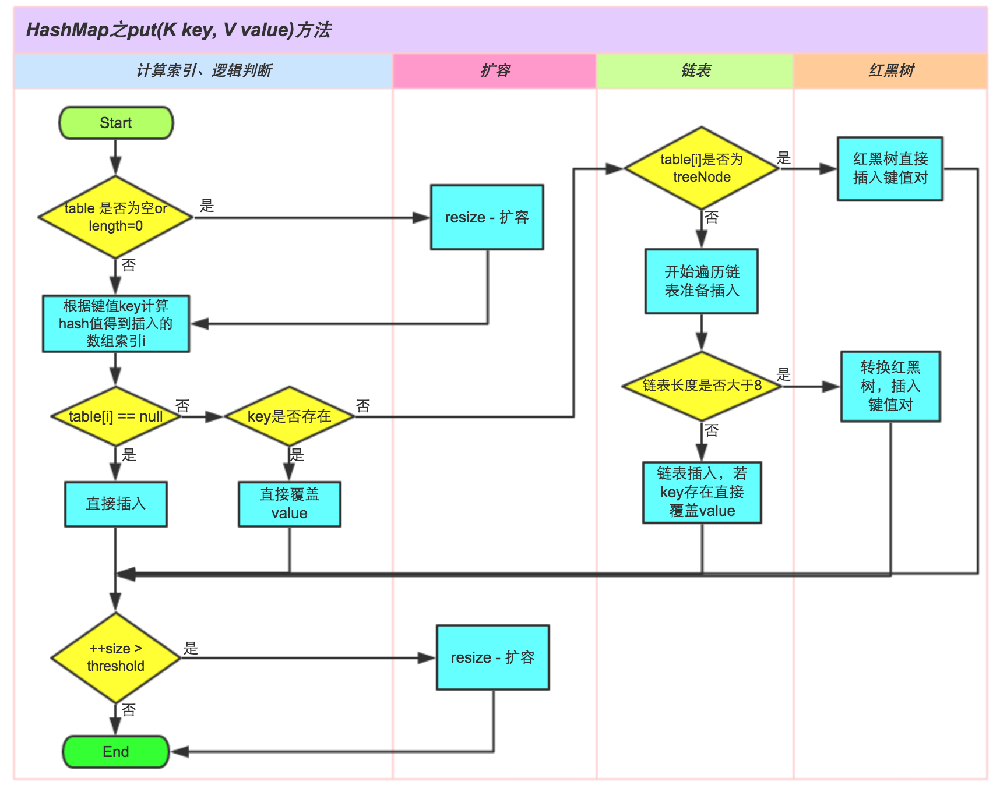
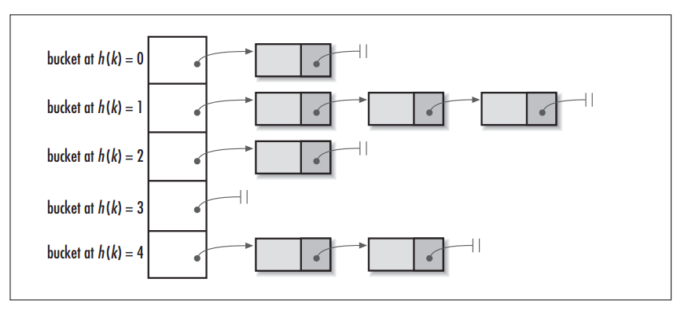
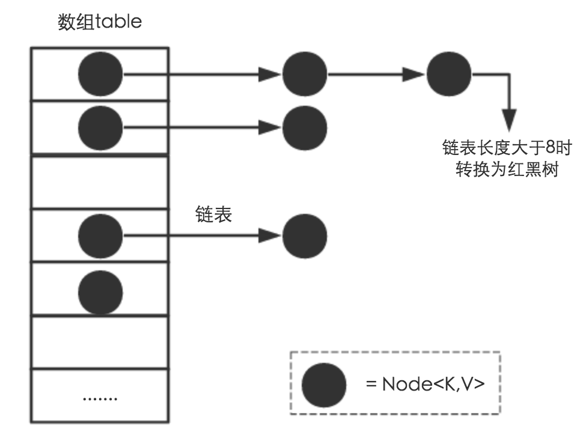

## HashMap结构分析 ##

#### 常见的集合

	Map接口和Collection接口是所有集合框架的父接口:  
> Collection接口的子接口包括：Set接口和List接口  
> Map接口的实现类主要有：HashMap、TreeMap、Hashtable、ConcurrentHashMap以及Properties等  
> Set接口的实现类主要有：HashSet、TreeSet、LinkedHashSet等  
> List接口的实现类主要有：ArrayList、LinkedList、Stack以及Vector等

#### HashMap的put方法的具体流程

**put方法的源码**：

```java
final V putVal(int hash, K key, V value, boolean onlyIfAbsent,
               boolean evict) {
    HashMap.Node<K,V>[] tab; HashMap.Node<K,V> p; int n, i;
    // 1.如果table为空或者长度为0，即没有元素，那么使用resize()方法扩容
    if ((tab = table) == null || (n = tab.length) == 0)
        n = (tab = resize()).length;
    // 2.计算插入存储的数组索引i，此处计算方法同 1.7 中的indexFor()方法
    // 如果数组为空，即不存在Hash冲突，则直接插入数组
    if ((p = tab[i = (n - 1) & hash]) == null)
        tab[i] = newNode(hash, key, value, null);
    // 3.插入时，如果发生Hash冲突，则依次往下判断
    else {
        HashMap.Node<K,V> e; K k;
        // a.判断table[i]的元素的key是否与需要插入的key一样，若相同则直接用新的value覆盖掉旧的value
        // 判断原则equals() - 所以需要当key的对象重写该方法
        if (p.hash == hash &&
                ((k = p.key) == key || (key != null && key.equals(k))))
            e = p;
        // b.继续判断：需要插入的数据结构是红黑树还是链表
        // 如果是红黑树，则直接在树中插入 or 更新键值对
        else if (p instanceof HashMap.TreeNode)
            e = ((HashMap.TreeNode<K,V>)p).putTreeVal(this, tab, hash, key, value);
        // 如果是链表，则在链表中插入 or 更新键值对
        else {
            // i .遍历table[i]，判断key是否已存在：采用equals对比当前遍历结点的key与需要插入数据的key
            //    如果存在相同的，则直接覆盖
            // ii.遍历完毕后任务发现上述情况，则直接在链表尾部插入数据
            //    插入完成后判断链表长度是否 > 8：若是，则把链表转换成红黑树
            for (int binCount = 0; ; ++binCount) {
                if ((e = p.next) == null) {
                    p.next = newNode(hash, key, value, null);
                    if (binCount >= TREEIFY_THRESHOLD - 1) // -1 for 1st
                        treeifyBin(tab, hash);
                    break;
                }
                if (e.hash == hash &&
                        ((k = e.key) == key || (key != null && key.equals(k))))
                    break;
                p = e;
            }
        }
        // 对于i 情况的后续操作：发现key已存在，直接用新value覆盖旧value&返回旧value
        if (e != null) { // existing mapping for key
            V oldValue = e.value;
            if (!onlyIfAbsent || oldValue == null)
                e.value = value;
            afterNodeAccess(e);
            return oldValue;
        }
    }
    ++modCount;
    // 插入成功后，判断实际存在的键值对数量size > 最大容量
    // 如果大于则进行扩容
    if (++size > threshold)
        resize();
    // 插入成功时会调用的方法（默认实现为空）
    afterNodeInsertion(evict);
    return null;
}
```
**put方法的流程图**：



#### HashMap的扩容操作如何实现的
> HashMap通过resize()方法进行扩容或者初始化的操作
```java
/**
 * 该函数有2中使用情况：1.初始化哈希表；2.当前数组容量过小，需要扩容
 */
final Node<K,V>[] resize() {
    Node<K,V>[] oldTab = table;// 扩容前的数组（当前数组）
    int oldCap = (oldTab == null) ? 0 : oldTab.length;// 扩容前的数组容量（数组长度）
    int oldThr = threshold;// 扩容前数组的阈值
    int newCap, newThr = 0;

    if (oldCap > 0) {
        // 针对情况2：若扩容前的数组容量超过最大值，则不再扩容
        if (oldCap >= MAXIMUM_CAPACITY) {
            threshold = Integer.MAX_VALUE;
            return oldTab;
        }
        // 针对情况2：若没有超过最大值，就扩容为原来的2倍（左移1位）
        else if ((newCap = oldCap << 1) < MAXIMUM_CAPACITY &&
                oldCap >= DEFAULT_INITIAL_CAPACITY)
            newThr = oldThr << 1; // double threshold
    }

    // 针对情况1：初始化哈希表（采用指定或者使用默认值的方式）
    else if (oldThr > 0) // initial capacity was placed in threshold
        newCap = oldThr;
    else {               // zero initial threshold signifies using defaults
        newCap = DEFAULT_INITIAL_CAPACITY;
        newThr = (int)(DEFAULT_LOAD_FACTOR * DEFAULT_INITIAL_CAPACITY);
    }

    // 计算新的resize上限
    if (newThr == 0) {
        float ft = (float)newCap * loadFactor;
        newThr = (newCap < MAXIMUM_CAPACITY && ft < (float)MAXIMUM_CAPACITY ?
                (int)ft : Integer.MAX_VALUE);
    }
    threshold = newThr;
    @SuppressWarnings({"rawtypes","unchecked"})
    Node<K,V>[] newTab = (Node<K,V>[])new Node[newCap];
    table = newTab;
    if (oldTab != null) {
        // 把每一个bucket都移动到新的bucket中去
        for (int j = 0; j < oldCap; ++j) {
            Node<K,V> e;
            if ((e = oldTab[j]) != null) {
                oldTab[j] = null;
                if (e.next == null)
                    newTab[e.hash & (newCap - 1)] = e;
                else if (e instanceof TreeNode)
                    ((TreeNode<K,V>)e).split(this, newTab, j, oldCap);
                else { // preserve order
                    Node<K,V> loHead = null, loTail = null;
                    Node<K,V> hiHead = null, hiTail = null;
                    Node<K,V> next;
                    do {
                        next = e.next;
                        if ((e.hash & oldCap) == 0) {
                            if (loTail == null)
                                loHead = e;
                            else
                                loTail.next = e;
                            loTail = e;
                        }
                        else {
                            if (hiTail == null)
                                hiHead = e;
                            else
                                hiTail.next = e;
                            hiTail = e;
                        }
                    } while ((e = next) != null);
                    if (loTail != null) {
                        loTail.next = null;
                        newTab[j] = loHead;
                    }
                    if (hiTail != null) {
                        hiTail.next = null;
                        newTab[j + oldCap] = hiHead;
                    }
                }
            }
        }
    }
    return newTab;
}
```

#### HashMap是怎么解决哈希冲突的

1. **什么是哈希？**
> Hash，一般翻译为“散列”，也有直接音译为“哈希”的，这就是把任意长度的输入通过散列算法，变换成固定长度的输出，该输出就是散列值（哈希值）；这种转换是一种压缩映射，也就是，散列值的空间通常远小于输入的空间，不同的输入可能会散列成相同的输出，所以不可能从散列值来唯一的确定输入值。简单的说就是一种将任意长度的消息压缩到某一固定长度的消息摘要的函数。  
> 所有散列函数都有如下一个基本特性：根据同一散列函数计算出的散列值如果不同，那么输入值肯定也不同。但是，根据同一散列函数计算出的散列值如果相同，输入值不一定相同。

2. **什么是哈希冲突？**
>当两个不同的输入值，根据同一散列函数计算出相同的散列值的现象，我们就把它叫做碰撞（哈希碰撞）。

3. **HashMap的数据结构**
> 在Java中，保存数据有两种比较简单的数据结构：**数组和链表**。**数组**的特点是：**寻址容易，插入和删除困难**；**链表**的特点是：**寻址困难，但插入和删除容易；**所以我们将数组和链表结合在一起，发挥两者各自的优势，使用一种叫做**链地址法**的方式可以解决哈希冲突：



这样我们就可以将拥有相同哈希值的对象组织成一个链表放在hash值所对应的bucket下，但相比于hashCode返回的int类型，我们HashMap初始的容量大小DEFAULT_INITIAL_CAPACITY = 1 << 4（即2的四次方16）要远小于int类型的范围，所以我们如果只是单纯的用hashCode取余来获取对应的bucket这将会大大增加哈希碰撞的概率，并且最坏情况下还会将HashMap变成一个单链表，所以我们还需要对hashCode作一定的优化.

4. **hash()函数**
> 主要是因为如果使用hashCode取余，那么相当于参与运算的只有hashCode的低位，高位是没有起到任何作用的，所以我们的思路就是让hashCode取值出的高位也参与运算，进一步降低hash碰撞的概率，使得数据分布更平均，我们把这样的操作称为扰动，在JDK 1.8中的hash()函数如下：
```java
static final int hash(Object key) {
    int h;
    return (key == null) ? 0 : (h = key.hashCode()) ^ (h >>> 16);// 与自己右移16位进行异或运算（高低位异或）
}
```
这比在JDK 1.7中，更为简洁，相比在1.7中的4次位运算，5次异或运算（9次扰动），在1.8中，只进行了1次位运算和1次异或运算（2次扰动）；

5. **JDK1.8新增红黑树**



通过上面的**链地址法（使用散列表）和扰动函数**我们成功让我们的数据分布更平均，哈希碰撞减少，但是当我们的HashMap中存在大量数据时，加入我们某个bucket下对应的链表有n个元素，那么遍历时间复杂度就为O(n)，为了针对这个问题，JDK1.8在HashMap中新增了红黑树的数据结构，进一步使得遍历复杂度降低至O(logn)；

#### 总结
HashMap是使用了哪些方法来有效解决哈希冲突的：
> 1. 使用链地址法（使用散列表）来链接拥有相同hash值的数据；
> 2. 使用2次扰动函数（hash函数）来降低哈希冲突的概率，使得数据分布更平均；
> 3. 引入红黑树进一步降低遍历的时间复杂度，使得遍历更快；

#### 面试： 为什么数组长度要保证为2的幂次方呢？
> 1. 只有当数组长度为2的幂次方时，h&(length-1)才等价于h%length，即实现了key的定位，2的幂次方也可以减少冲突次数，提高HashMap的查询效率；  
> 2. 如果 length 为 2 的次幂 则 length-1 转化为二进制必定是 11111……的形式，在于 h 的二进制与操作效率会非常的快，而且空间不浪费；如果 length 不是 2 的次幂，比如 length 为 15，则 length - 1 为 14，对应的二进制为 1110，在于 h 与操作，最后一位都为 0 ，而 0001，0011，0101，1001，1011，0111，1101 这几个位置永远都不能存放元素了，空间浪费相当大，更糟的是这种情况中，数组可以使用的位置比数组长度小了很多，这意味着进一步增加了碰撞的几率，减慢了查询的效率！这样就会造成空间的浪费。

#### 面试： 那为什么是两次扰动呢？
> 这样就是加大哈希值低位的随机性，使得分布更均匀，从而提高对应数组存储下标位置的随机性&均匀性，最终减少Hash冲突，两次就够了，已经达到了高位低位同时参与运算的目的；

#### 面试： 为什么HashMap中String、Integer这样的包装类适合作为Key?
String、Integer等包装类的特性能够保证Hash值的不可更改性和计算准确性，能够有效的减少Hash碰撞的几率
> 1. 都是final类型，即不可变性，保证key的不可更改性，不会存在获取hash值不同的情况   
> 2. 内部已重写了equals()、hashCode()等方法，遵守了HashMap内部的规范（不清楚可以去上面看看putValue的过程），不容易出现Hash值计算错误的情况；

#### 面试：如果我想要让自己的Object作为Key应该怎么办呢?
重写hashCode()和equals()方法
> 1. **重写hashCode()**是因为需要**计算存储数据的存储位置**，需要注意不要试图从散列码计算中排除掉一个对象的关键部分来提高性能，这样虽然能更快但可能会导致更多的Hash碰撞；   
> 2. **重写equals()方法**，需要遵守自反性、对称性、传递性、一致性以及对于任何非null的引用值x，x.equals(null)必须返回false的这几个特性，目的是**为了保证key在哈希表中的唯一性**；


## 转载至
[Java集合必会14问（精选面试题整理）](https://www.jianshu.com/p/939b8a672070)