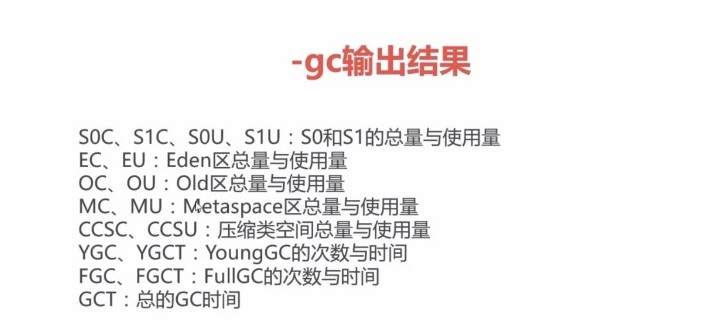
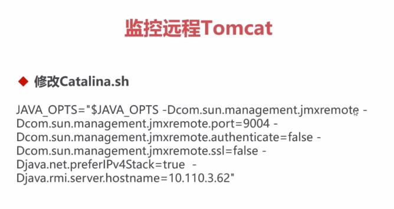
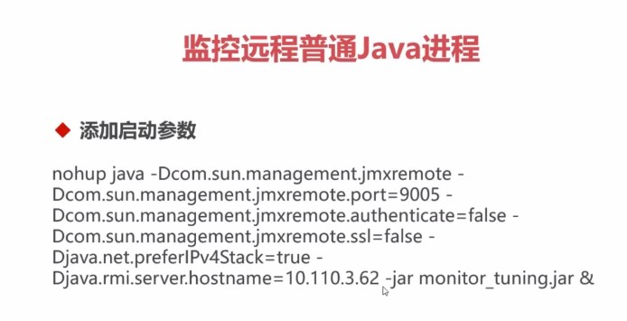
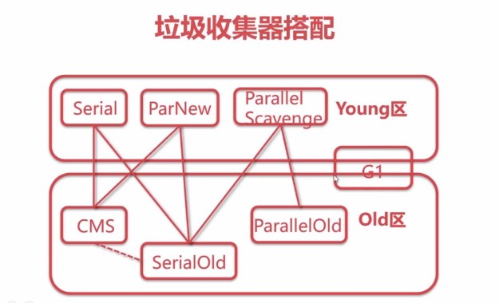

## JVM参数类型 ##
1. 标准参数：如下示例
	1. -help
	2. -server -client
	3. -version -showversion
	4. -cp -classpath
2. X参数(非标准化参数)：如下示例
	1. -Xint: 解释执行
	2. -Xcomp: 第一次使用就编译成本地代码
	3. -Xmixed： 混合模式，JVM自己来决定是否编译成本地代码
3. XX参数(非标准化参数、相对不稳定、主要用于JVM调优和Debug)：如下示例
	1. Boolean类型
		> 格式：-XX:[+-]<name>标识启用或者禁用name属性  
		> 比如：-XX:+UseConcMarkSweepGC  
		>           -XX:+UseG1GC
	2. 非Boolean类型
		>格式：-XX:<name>=<value> 表示name属性的值是value  
		>比如：-XX:MaxGCPauseMillis=500  
		>     -XX:GCTimeRatio=19

	**-Xmx -Xms**：不是X参数、而是XX参数  
	-Xms等价于 -XX:InitialHeapSize (初始堆的大小)  
	-Xmx等价于 -XX:MaxHeapSize(最大堆的大小)  

## 查看JVM运行时参数 ##
1. -XX:+PrintFlagsInitial（查看初始值）
	> java -XX:+PrintFlagsInitial -version
2. -XX:+PrintFlagsFinal (查看最终值)
3. -XX:+UnlockExperimentalVMOptions(解锁实验参数)
4. -XX:+UnlockDiagnosticVMOptions(解锁诊断参数)
5. -XX:+PrintCommandLineFlags(打印命令行参数)
6. jps(专门用来查看java进程的命令)
7. jinfo(查看正在运行时的JVM)
	-  查看tomcat的最大内存
		> jinfo -flag MaxHeapSize 6416   
		> 输出结果：  -XX:MaxHeapSize=3189768192
	-  查看垃圾回收器
		> jinfo -flag UseConcMarkSweepGC 6416  
		> 输出结果： -XX:-UseConcMarkSweepGC  
		> jinfo -flag UseG1GC 6416  
		> 输出结果： -XX:-UseG1GC  
		> jinfo -flag UseParallelGC 6416  
		> 输出结果： -XX:+UseParallelGC  


## jstat查看JVM统计信息 ##
1. 查看类加载的信息
2. 查看垃圾收集
3. JIT编译

-gc输出结果：



堆内存快照
-XX:+HeapDumpOnOutOfMemoryError   
-XX:HeapDumpPath=./

## 使用JVisualVM执行远程监控tomcat

## 使用JVisualVM执行远程监控普通java进程


## BTrace介绍
1. BTrace可以动态的向目标应用程序的字节码注入追踪代码
2. JavaCompilerApi、JVMTI、Agent、Instrumentation+ASM

## BTrace安装
1. 新建环境变量BTRACE_HOME
2. 添加Path：%BTRACE_HOME%\bin

## BTrace运行脚本方式
1. 在JVisualVM中添加BTrace插件，添加classpath 
2. 使用命令行btrace <pid> <trace_script>  

## BTrace 入门
```
import com.sun.btrace.AnyType;
import com.sun.btrace.BTraceUtils;
import com.sun.btrace.annotations.BTrace;
import com.sun.btrace.annotations.Kind;
import com.sun.btrace.annotations.Location;
import com.sun.btrace.annotations.OnMethod;
import com.sun.btrace.annotations.ProbeClassName;
import com.sun.btrace.annotations.ProbeMethodName;

@BTrace
public class PrintArgSimple {

	@OnMethod(
			clazz = "com.zephyr.monitor.tuning.chapter4.Ch4Controller", 
			method = "arg1", 
			location = @Location(Kind.ENTRY)
	)
	public static void anyRead(@ProbeClassName String pcn, @ProbeMethodName String pmn, AnyType[] args) {
		BTraceUtils.printArray(args);
		BTraceUtils.println(pcn + " , " + pmn);
		BTraceUtils.println();
	}
}

```
```
@RestController
@RequestMapping("/ch4")
public class Ch4Controller {

	@GetMapping("/arg1")
	public String arg1(@RequestParam("name") String name) {
		return "Hello," + name;
	}
	
	@GetMapping("/constructor")
	public User constructor(User user) {
		return user;
	}
	
	@GetMapping("/same1")
	public String same(@RequestParam("name") String name) {
		return "Hello," + name;
	}
	
	@GetMapping("/same2")
	public String same(@RequestParam("name") String name, @RequestParam("id") Integer id) {
		return "Hello," + name + ", your id is :" + id;
	}
}
```
## 拦截构造函数
```
import com.sun.btrace.AnyType;
import com.sun.btrace.BTraceUtils;
import com.sun.btrace.annotations.BTrace;
import com.sun.btrace.annotations.OnMethod;
import com.sun.btrace.annotations.ProbeClassName;
import com.sun.btrace.annotations.ProbeMethodName;

@BTrace
public class PrintConstructor {

	@OnMethod(
			clazz = "com.zephyr.monitor.tuning.chapter2.User",
			method="<init>"
	)
	public static void anyRead(@ProbeClassName String pcn, @ProbeMethodName String pmn, AnyType[] args) {
		BTraceUtils.printArray(args);
		BTraceUtils.println(pcn+","+pmn);
		BTraceUtils.println();
	}
}
```

## 拦截同名函数
```
@BTrace
public class PrintSame {

	@OnMethod(
			clazz = "com.zephyr.monitor.tuning.chapter4.Ch4Controller",
			method="same"
	)
	public static void anyRead(@ProbeClassName String pcn, @ProbeMethodName String pmn, String name) {
		BTraceUtils.println(pcn + " , " + pmn + " , " + name);
		BTraceUtils.println();
	}
}

@BTrace
public class PrintSame {

	@OnMethod(
			clazz = "com.zephyr.monitor.tuning.chapter4.Ch4Controller",
			method="same"
	)
	public static void anyRead(@ProbeClassName String pcn, @ProbeMethodName String pmn, String name, Integer id) {
		BTraceUtils.println(pcn + " , " + pmn + " , " + name + " , " + id);
		BTraceUtils.println();
	}
}
```

## 以下参考内容
[参考地址](http://www.cellei.com/blog/2019/01091)

## BTrace使用限制
> 由于BTrace脚本会向线上代码中注入字节码，即使退出后，注入的字节码也不会恢复，注入的监控代码依然会执行，所以使用BTrace时有一些限制必须遵守，正因为这些限制，BTrace才能更放心的在线上调试中使用。

1. BTrace脚本中不能创建对象、创建数组、捕获和抛出异常。
2. 不能调用实例或静态方法，只能调用com.sun.btrace.BTraceUtils中的静态方法。
3. 不能把目标程序的类或对象赋值给静态或实例字段。
4. 不能定义外部, 内部, 匿名, 本地类。
5. 不能使用同步synchronized代码块和同步方法。
6. 不能使用for、while等循环语句。
7. 不能扩展类，父类必须是Object，不允许实现接口。
8. 不能使用assert语句，不能使用Class字面值，例如Class<String> c = String.class;

## BTrace注解
注解都在com.sun.btrace.annotations包下，分为类注解、方法注解、方法参数注解、属性注解。

## 类注解
- @BTrace：用来指明这个Java类是个BTrace脚本程序，被BTrace编译器和BTrace代理执行。
- @DTrace及@DTraceRef：是单独给Solaris系统使用的，一般使用不到。

## 方法注解
- @OnMethod：用来指定监控的目标代码，它有三个常用属性，clazz、method、location。
1. clazz 属性用来指定目标代码的类名，支持全限定名/正则/父类/注解形式。全限定名，例如java.lang.Thread；也可以使用正则表达式匹配，例如/java\\.lang\\..+/；父类或接口的形式，例如+java.lang.Runnable，注解形式，例如`@javax.annotation.Resource`。内部类使用$符号连接。
2. method 属性用来指定目标代码的方法名，支持全限定名/正则/注解形式，特殊的，指定构造方法时使用<init>表示，目标类有重载的方法时，根据@OnMethod修饰的方法的参数列表具体指明哪个目标方法。
3. location 属性指定目标代码的拦截时机，比如是进入目标方法时拦截（默认），还是目标方法返回值的时候拦截，后面会详细讲到。

- @OnTimer：用来周期性的、每隔N毫秒定期执行该注解修饰的方法，例如@OnTimer(4000)表示每间隔4000毫秒执行一次。
- @OnError：当BTrace脚本中其他任何跟踪行为发生异常时，该注解修饰的方法会被执行。
- @OnExit：当BTrace脚本使用代码BTraceUtils.Sys.exit(0)来退出BTrace命令行会话时，该注解修饰的方法会被执行。
- @OnEvent：当在BTrace客户端命令行下发生外部事件时，该注解修饰的方法会被执行，此注解的值为事件名称，默认值为”SIGINT”。目前，当执行ctrl+c操作时，该注解修饰的方法就会被执行。
- @OnLowMemory：用来监测JVM中堆内存是否达到阈值，它有两个属性pool、threshold，pool指定监测年轻代还是老年代，GC算法不同也会有所不同，threshold指定阈值大小，举例@OnLowMemory(pool = "Tenured Gen",threshold=6000000)
- @OnProbe：该注解可以用来避免使用BTrace脚本的内部类，需要和xml映射文件配合使用，详见User’s Guide.

## 拦截时机
1. @OnMethod注解的location属性指明拦截目标代码的拦截时机，经常使用的有如下几个：
	1. Kind.ENTRY：刚进入目标方法时就执行，当没有指明location时，此为默认值。
	2. Kind.RETURN：目标方法返回时执行，配合方法参数注解@Duration可以获取目标方法执行时间，单位纳秒。
	3. Kind.THROW：目标方法有异常被抛出时。
	4. Kind.CATCH：目标方法有异常被捕获时。
	5. Kind.ERROR：目标方法有异常没被捕获抛出了方法之外。
	6. Kind.CALL：目标方法被调用时。
	7. Kind.LINE：目标方法具体某一行被执行时，值为-1表示方法内所有代码行。

## 方法参数注解
- @ProbeClassName：目标代码的类名，全限定名，@OnMethod的clazz中定义。
- @ProbeMethodName：目标代码的方法名，@OnMethod的method中定义。
- @Duration：目标方法执行时间，与Kind.RETURN配合使用。
- @Return：目标方法返回值，与Kind.RETURN配合使用。
- @Self：目标实例，指向this关键字的值。
- @TargetInstance：与Kind.CALL一起使用，代表location中定义的监控到的调用实例。
- @TargetMethodOrField：与Kind.CALL一起使用，代表location中定义的监控到的调用方法与属性。

## 属性注解
- @TLS：ThreadLocal变量，可用于在多个拦截方法间通信、共享变量，只能在使用@OnMethod注解的拦截方法中访问。
- @Export：该注解标注的字段可以被映射到一个jvmstat计数器上，用以暴露给外部的jvmstat客户端（例如jstat）。


----------


## 垃圾收集算法
- 思想： 枚举根节点，做可达性分析
- 根节点： 类加载器、Thread、虚拟机栈的本地变量表、static成员、常量引用、本地方法栈的变量等

#### 标记清除算法
-  算法： 算法分为 **“标记”** 和 **“清除”**两个阶段，首先标记出所有需要回收的对象，在标记完成后，统一回收
-  缺点： 效率不高。标记和清除两个过程的效率都不高，产生碎片，碎片太多会导致提前GC

#### 复制算法
- 算法： 它将可用内存按容量划分为大小相等的两块，每次只使用其中的一块。当这一块内存用完了，就将存活着的对象复制到另外一块上面，然后再把已使用过的内存空间一次清理掉
- 优缺点： 实现简单，运行高效，但是空间利用率低

#### 标记整理
- 算法： 标记过程仍然与“标记-清除”算法一样，但后续步骤不是直接对可回收对象进行清理，而是让所有存活的对象都向一端移动，然后直接清理掉端边界以外的内存
- 优缺点： 没有了内存碎片，但是整理内存比较耗时

#### 分代垃圾回收
- Young区用复制算法
- Old区用标记清除或者标记整理

#### 对象分配过程
1. 对象优先在Eden区分配
2. 大对象直接进入老年代：-XX:PretenureSizeThreshold(当对象的值超过该参数时，则会被定义为大对象)
3. 长期存活对象进入老年代： -XX:MaxTenuringThreshold -XX:+PrintTenuringDistribution -XX:TargetSurvivorRatio（没经过一次Young区的GC之后，存活的对象年龄就会加1，等年龄到达了MaxTenuringThreshold值时，就会进入老年代，当Survivor区的垃圾回收之后，存活比例达到80%，并计算80%的对象的平均年龄，然后计算平均年龄达到了MaxTenuringThreshold的最小值，就会进入老年代）。


## 垃圾收集器
1. 串行收集器Serial： Serial、Serial Old
2. 并行收集器Parallel： Parallel Scavenge、Parallel Old、吞吐量
3. 并发收集器Concurrent： CMS、G1、停顿时间

## 并行 VS 并发
1. 并行(Parallel)： 指多条垃圾收集线程并行工作，但此时用户线程仍然处于等待状态。适合科学计算，后台处理器等弱交互场景

2. 并发(Concurrent)： 指用户线程与垃圾收集线程同时执行(但不一定是并行，可能会交替执行)，垃圾收集线程在执行的时候不会停顿用户程序的运行。适合对响应时间有要求的场景，比如：Web 

## 停顿时间 VS 吞吐量
1. 停顿时间： 垃圾收集器做垃圾回收时中断应用执行的时间。 -XX：MaxGCPauseMillis

2. 吞吐量： 花在垃圾收集的时间和花在应用执行时间的占比。-XX:GCTimeRatio=<n>，垃圾收集时间占：1/1+n

## 开启串行收集器
> -XX:+UseSerialGC -XX:+UseSerialOldGC

## 开启并行收集器
> 吞吐量优先  
> -XX:+UseParallelGC -XX:+UseParallelOldGC  
> Server模式下的默认收集器  

## 开启并发收集器
> 响应时间优先  
> CMS: -XX:+UseConcMarkSweepGC -XX:+UseParNewGC  
> G1: -XX:+UseG1GC  

## 垃圾收集器搭配使用


## 如何选择垃圾收集器
1. 优先调整堆的大小，让服务器自己选择
2. 如果内存小于100M，使用串行收集器
3. 如果是单核，并且没有停顿时间的要求，串行或者JVM自己选
4. 如果允许停顿时间超过1秒，选择并行或者JVM自己选
5. 如果响应时间最重要，并且不能超过1秒，使用并发收集器

## 并行收集器(Parallel Collector)
> -XX:+UseParallelGC手动开启，Server模式是默认开启  
> -XX:ParallelGCThreads=<N>多少个GC线程  
> CPU>8 N=5/8 &emsp; CPU<8 N=CPU

## 并行收集器的自适应设置(Parallel Collector Ergonomics)
> -XX:MaxGCPauseMillis=<N> （设置最大停顿时间）  
> -XX:GCTimeRatio=<N>（吞吐量）    
> -Xmx<N>

## 动态内存调整
> Young区： -XX:YoungGenerationSizeIncrement=《Y》   
> Old区： &emsp;-XX:TenuredGenerationSizeIncrement=《T》     
> 调整的太大了，需要减少时： -XX:AdaptiveSizeDecrementScaleFactor=<D>


## 并发收集器(CMS Collector)
1. 并发收集器
2. 低停顿、低延迟
3. 老年代收集器

## CMS垃圾收集过程
1. CMS initial mark： 初始标记Root，STW(Stop Work)
2. CMS Concurrent mark: 并发标记
3. CMS-concurrent-preclean: 并发预清理
4. CMS remark： 重新标记， STW(Stop Work（需要停止应用程序）)
5. CMS concurrent sweep： 并发清除
6. CMS-concurrent-reset： 并发重置

## CMS收集器的缺点
1. CPU敏感
2. 浮动垃圾
3. 空间碎片

## CMS的相关参数
> -XX:ConcGCThreads: 并发的GC线程数  
> -XX:+UseCMSCompactAtFullCollection: FullGC之后做压缩  
> -XX:CMSFullGCsBeforeCompaction: 多少次FullGC之后压缩一次    
> -XX:CMSInitiatingOccupancyFraction: 触发FullGC  
> -XX:+UseCMSInitiatingOccupancyOnly: 是否动态调  
> -XX:+CMSScavengeBeforeRemark: FullGC之前先做Young GC  
> -XX:+CMSClassUnloadingEnabled: 启用回收Perm区


## G1垃圾收集器（G1 Collector）
1. 简介
>  The first focus of G1 is to provide a solution for users running application that require large heaps with limited GC latency. This meas heap sizes of around 6 GC or larger, and a stable and predictable pause time below 0.5 seconds.
2. 新生代和老生代的垃圾收集器

## G1的几个概念
1. Region
2. SATB： Snapshot-At-The-Beginning，它是通过Root Tracing得到的，GC开始时候存活对象的快照
3. RSet： 记录了其他Region中的对象引用本Region中对象的关系，属于points-into结构（谁引用了我的对象）

## Young GC
1. 新对象进入Eden区
2. 存活对象拷贝到Survivor区
3. 存活时间达到年龄阈值时，对象晋升到Old区

## Mixed GC
1. 不是FullGC，回收所有的Young区和部分Old区
2. global concurrent marking
	1. Initial marking phase: 标记GC Root， STW(Stop应用程序work)
	2. Root region scanning phase: 标记存活Region
	3. Concurrent marking phase: 标记存活的对象
	4. Remark phase: 重新标记 STW
	5. Cleanup phase: 部分STW

## Mixed GC的时机
1. InitiatingHeapOccupancyPercent: 堆占有率达到这个数值则出发global concurrent marking，默认45%
2. G1HeapWastePercent: 在global concurrent marking结束之后，可以知道区有多少空间要被回收，在每次YoungGC之后和再次发生Mixed GC之前，会检查垃圾占比是否达到此参数，只有达到了，下次才会发生Mixed GC

## Mixed GC的相关参数
> G1MixedGCLiveThresholdPercent: Old区的region被回收时候的存活对象占比  
> G1MixedGCCountTarget: 一次global concurrent marking之后，最多执行Mixed GC的次数  
> G1OldCSetRegionThresholdPercent: 一次Mixed GC中能被选入CSet的最多old区的region数量

## 常用参数
> -XX:+UseG1GC ， 开启G1  
> -XX:G1HeapRegionSize=n，region的大小，1~32M，2048个  
> -XX:MaxGCPauseMillis=200， 最大停顿是时间  
> -XX:G1NewSizePercent、-XX:G1MaxNewSizePercent(Young区的初始占比和最大占比)  
> -XX:G1ReservePercent=10 保留防止to space溢出(防止往Survivor区拷贝的时候，不够)  
> -XX:ParallelGCThreads=n （并行的GC线程数） SWT线程数(停止应用程序的线程数)  
> -XX:ConcGCThreads=n 并发线程数=1/4*并行

## 是否需要切换到G1
1. 50%以上的堆被存活对象占用
2. 对象分配和晋升的速度变化非常大
3. 垃圾回收时间特别长，超过了1秒