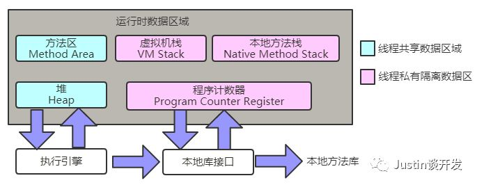
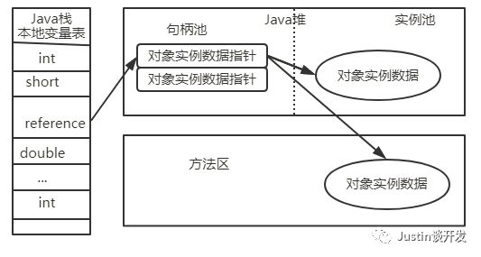
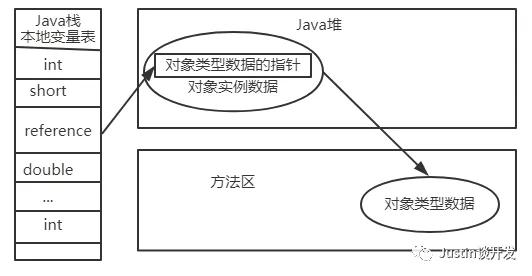

## JVM系列之Java内存区域

#### 前言
对于Java开发者来说，在虚拟机的自动内存管理机制下，不需要去关心每个对象的存亡，只需要创建出来就完全扔给了虚拟机去处理，而且还不容易出现内存泄露和内存溢出的问题，这看起来很美好，但是如果一旦出现内存泄露和溢出的问题，你就会很棘手，所以我们一定要了解Java虚拟机是如何管理内存的，否则你排出问题将无从下手。下面我们将从以下2个方面谈谈Java虚拟机的内存区域：**运行时数据区域、对象访问**。

#### 运行时数据区域
Java虚拟机在执行Java程序时会把它管理的内存划分为若干区域，这些区域各有自己的作用，如下图所示：

- **程序计数器**： 是一块很小的内存空间，作用是当前线程所执行的字节码的行号指示器；
	
	
	字节码解释器工作时就是提供改变这个计数器的值来选取下一个需要执行的字节码指令，
	分支、循环、跳转、异常处理、线程恢复等基础功能和需要依赖计数器去完成；
			
	由于虚拟机的多线程是通过线程轮流切换并分配处理器执行时间的方式来实现的，
	任何时刻一个处理器只会执行一条线程中的指令，因此为了保证线程切换后能恢复到正确的执行位置，
	每条线程都需要一个单独的计数器，各个线程之间的计数器互不影响，独立存储，这类内存称为线程私有内存；
	
	如果线程正在执行的是一个Java方法，那么计数器记录的是正在执行的虚拟机字节码指令的地址；
	
	如果线程正在执行的是Native方法，那么计数器的值为(undefined)，
	该内存是唯一一个在虚拟机中没有规定任何内存溢出的区域。

- **Java虚拟机栈**： 和程序计数器一样，Java虚拟机栈也是线程私有的，生命周期和线程相同。虚拟机栈描述的是Java方法执行的内存模型：每个方法被执行行的时候都会创建一个栈帧（运行期的基本数据结构）用于存储局部变量表、操作栈、动态链接和方法出口等，每一个方法被调用直至执行完成的过程，就对应一个栈帧在虚拟机中从入栈到出栈的过程；

	经常有人会把Java内存区分为堆内存和栈内存，而这个栈指的就是虚拟机栈，或者说是虚拟机栈中的局部变量表；

	局部变量表：存放了预编译期可知的各种基本数据类型、对象引用和returnAddress类型，
	局部变量表所需的内存空间在编译期间完成分配，当进入一个方法时，
	这个方法需要的帧中分配多大的局部变量空间是完全确定的，在运行期间不会改变局部变量表的大小；

	栈异常：如果线程请求的栈深度大于虚拟机所允许的深度，将抛出StackOverflowError异常；
	如果虚拟机栈可以动态扩展，当扩展时无法申请到足够的内存时会抛出OutOfMemoryError异常；

- **本地方法栈**： 本地方法栈与虚拟机栈的作用是非常相似的，区别在于虚拟机栈为虚拟机执行java方法服务，而本地方法栈则为虚拟机使用到的native方法服务，虚拟机规范中对本地方法栈没有强制规定，甚至有的虚拟机直接就把本地方法栈和虚拟机栈合二为一，与虚拟机栈一样，本地方法栈也会抛出StackOverflowError异常和OutOfMemoryError异常；

- **Java堆**： 堆是Java虚拟机所管理的内存中最大的一块，被所有线程共享的一块区域，在虚拟机启动时创建；此内存区域唯一的目的就是存放对象实例，几乎所有的对象实例都要在堆上分配（不是所有的，随着JIT编译器技术的发展和逃逸分析技术的成熟，栈上分配、标量替换优化技术导致并不是所有的对象都必须在堆上分配内存）；

	
	Java堆是垃圾收集器管理的主要区域，因此很多时候也称为GC堆，垃圾回收这里先不讲解，后面后详细讲解；

	根据Java虚拟机规范规定，Java堆可以处于物理上不连续的内存空间中，只要逻辑上是连续的就可以了，
	就像我们的磁盘空间一样。在实现时，既可以实现固定大小的，也可以是可扩展的，
	当前主流的虚拟机都是按可扩展来实现的（通过-Xmx和-Xms设置），
	如果在堆中没有内存实例分配，并且堆也无法再扩展时，将会抛出OutOfMemoryError异常；

- **方法区**： 与Java堆一样，是各个线程共享的内存区域，用于存储已被虚拟机加载的类信息、常量、静态变量、即时编译后的代码等数据；

		
	对于HotSpot虚拟机来说，方法区又被称为“永久代”，HotSpot虚拟机设计团队选择把GC分代收集扩展到方法区，
	或者说使用永久代来实现方法区，对于其他虚拟机来说，根本就不存在永久代的概念
	（JDK8开始，HotSpot也将永久代废弃了，使用本地内存Metaspace替代）；

	当方法区无法满足内存分配需求时，会抛出OutOfMemoryError异常；

- **运行时常量池**： 运行时常量池是方法区的一部分。Class文件中除了有类的版本，字段，方法，接口等描述信息外，还有一项信息是常量池，用于存放编译期生成的各种字面量和符号引用，这部分内容将在类加载后存放到方法区的运行时常量池中，一般来说除了保持class文件中描述的符号引用之外，还会把翻译出来的直接引用也存储到运行时常量池中；

	
	运行时常量池相对于class文件常量池的另一个重要特征是具备动态性，Java语言并不要求常量一定只能在编译期产生，
	也就是并非预置入class文件中常量池的内容才能进入方法区运行时常量池，运行期间也可能将新的常量放入池中，
	这种特性被开发者利用的比较多的便是String类的intern()方法；

	既然运行时常量池是方法区的一部分，自然受到方法区内存的限制，
	当常量池无法再申请到内存时就会抛出OutOfMemoryError异常；

- **直接内存**： 直接内存不是虚拟机运行时数据区的一部分，也不是Java虚拟机规范中定义的内存区域，但是这部分内存使用比较频繁，也可能会导致内存溢出，所以也放这里讲下；

	
	jdk1.4以后新加入的NIO中，引入了一种基于通道与缓冲区的I/O方式，他可以使用本地函数库直接分配堆外内存，
	然后通过一个存储在Java堆里面的DirectByteBuffer对象作为这块内存的引用进行操作，
	避免在Java堆和本地堆中来回复制数据，因此能在一些场景中显著提高性能；

	本地直接内存分配不会受到Java堆大小的限制，但是既然是内存，
	则肯定会受到本机总内存的大小及处理器寻址空间的限制。一般我们在配置虚拟机参数时，
	都会根据实际内存设置-Xmx等参数，但是会经常忽略掉直接内存，
	使得各个内存区域的总和大于物理内存限制，从而导致动态扩展时出现OutOfMemoryError异常；

#### 对象访问
在Java语言中，对象访问是如何进行的呢？主要涉及Java栈，Java堆，方法区这三个重要的内存区域之间的关联关系，例如：Object object = new Object()，假设这句代码在方法体中出现，那么Object object这部分语义将会反映到Java栈的本地变量中，作为一个reference（引用）类型数据出现，而new Object()语义将会反映到Java堆中，形成一块存储了Object类型所有实例数据值的结构化内存，根据具体类型以及虚拟机实现的对象内存布局的不同，这块内存的长度不固定。另外，在Java堆中还必须包含能查找到此对象类型数据的地址信息，这些类型数据则存储在方法区中；

由于在Java虚拟机中引用类型只规定了一个指向对象的引用，并没有定义这个引用应该通过哪种方式去定位，以及访问到Java堆中的对象具体位置，因此不同的虚拟机实现的对象访问方式也不同，主要分为下面2种：

- **句柄**： Java堆中会划分出一块内存来作为句柄池，引用中存储的就是对象的句柄地址，而句柄中包含了对象实例数据和类型数据各自的具体地址信息；

- **直接指针**： Java堆对象的布局中就必须考虑如何放置访问类型数据的相关信息，引用中直接存储的就是对象地址，如下图所示：

这两种对象访问方式，各有优先，使用句柄访问最大的好处是引用中存储的是稳定的句柄地址，在对象被移动时只会改变句柄中的实例数据指针，而引用本身不需要被修改；

使用直接指针访问方式最大的好处是速度更快，它节省了一次指针定位的时间开销，由于对象的访问在Java中非常频繁，因此这类开销积少成多之后也是一项很可观的执行成本，HotSpot中就是采用直接指针访问的方式。

## 转载
[Justin的后端书架--JVM系列之Java内存区域](https://mp.weixin.qq.com/s/PcbKhhqFRbvPtlxhpgXODA)