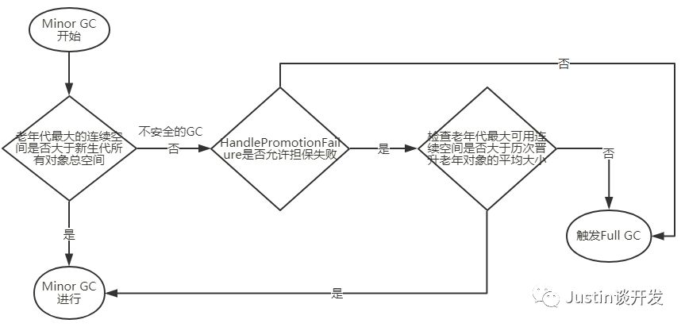

## JVM系列之内存分配与回收策略 ##

#### **前言**
经过前面几篇文章，我们已经对JVM虚拟机有了个初步认识，也了解了各区域应用哪些收集器，以及每个收集器用哪些收集算法，但是在这一系列过程中，其实就是一个对象的由生到死的过程，那么在这过程中对象是怎么处理它的生命周期的呢，今天我们就来介绍下对象在内存中的分配和回收分配给对象的内存，那么，让我们带着愉快的周末心情来开启今天的JVM之旅吧。

#### **内存分配**
内存分配，通俗讲就是对象在堆上分配：对象主要分配在新生代的Eden区上，如果启动了本地线程分配缓冲，将按线程优先在TLAB上分配。少数对象也可能直接分配在老年代中，下面我们将具体讲解：

**TLAB解释**：全称为Thread Local Allocation Buffer即线程本地分配缓存，从名称上看是一个线程专用的内存分配区域，是为了加速对象分配而生的。每一个线程都会产生一个TLAB，该线程独享的工作区域，java虚拟机使用这种TLAB区来避免多线程冲突的问题，提高了对象分配的效率。TLAB空间一般不会太大，当大对象无法在TLAB上分配时，则会直接分配到堆上；

**对象优先在Eden分配**：大多数情况下，对象在新手代Eden区中分配，当Eden区没有足够空间进行分配时，虚拟机将发起一次Minor GC，虚拟机提供-XX:+PrintGCDetails配置收集器日志参数，通知虚拟机在发生垃圾收集时打印内存回收日志，并且在进程退出时输出当前内存各区域分配情况。

**大对象直接进入老年代**：大对象，指的就是需要大量连续内存空间的Java对象，比较典型的大对象就是那种很长的字符串以及数组，经常出现大对象容易导致当内存空间还有很多的时候就提前触发收集器收集以获取足够连续的内存空间；

虚拟机提供一个可控制的参数：-XX:PretenureSizeThreshold来设置对象直接进入老年代的阈值，当对象大于这个值直接进入老年代，这样做是为了避免在Eden区和Survivor区之间发生大量的内存复制。

**长期存活的对象将直接进入老年代**：新生代的对象每个对象设置一个计数器（age），出生时首先分配在Eden区，如果经过第一次Minor GC还存活，并且能被Survivor接纳的对象，则进入Survivor空间中，并且对象年龄设为1，对于在Survivor空间中的对象，每经历一次Minor GC，年龄加+1，当它的年龄增加到一定程度（默认为15），就将晋升到老年代；这就好比我们人刚形成时在母亲体内（Eden），出生后（Survivor）每过一年（Minor GC），年龄就+1，到了一定程度（18岁）就成年了；

虚拟机提供一个可控制的参数：-XX:MaxTenuringThreshold来控制新生代晋升到老年代的阈值（默认为15）。

#### **扩展**
Minor GC （新生代GC）：发生在新生代的垃圾收集动作，因为Java对象大多数都具备朝生夕灭的特点，所以Minor GC非常频繁，一般回收速度也很快；

**Full GC（老年代GC）**：**又称Major GC，**发生在老年代的垃圾收集，通常发生Full GC意味着至少发生了一次Minor GC（直接出生早老年代的除外），Full GC因为都是大对象回收，所以通常速度要比Minor GC慢很多；

#### **回收策略**
对象年龄动态判定：为了更好的适应不同程序的内存状况，虚拟机并不是永远要求对象年龄必须达到XX:MaxTenuringThreshold才能晋升到老年代，如果在Survivor空间中，相同年龄的所有对象大小的和大于Survivor空间的一半，就会将Survivor空间中年龄大于或者等于该年龄的对象直接进入老年代；

**空间分配担保**：什么是空间分配担保？在发生Minor GC之前，虚拟机会检查老年代最大的连续空间是否大于新生代所有对象总空间，如果成立那么就能确保此次GC是安全的。如果不成立，即Minor GC不是安全的，那么虚拟机就会查看HandlePromotionFailure设置的值是否允许担保失败（不安全的Minor GC），
如果允许，那么检查老年代最大可用连续空间是否大于历次晋升老年对象的平均大小，如果大于则继续Minor GC（尽管是有风险的），如果不允许或者小于平均大小，则触发一次Full GC，流程图如下：

## 转载
[Justin的后端书架--JVM系列之内存分配与回收策略](https://mp.weixin.qq.com/s/EfbsMvr3Gt1RGN0x_Ya64g)
