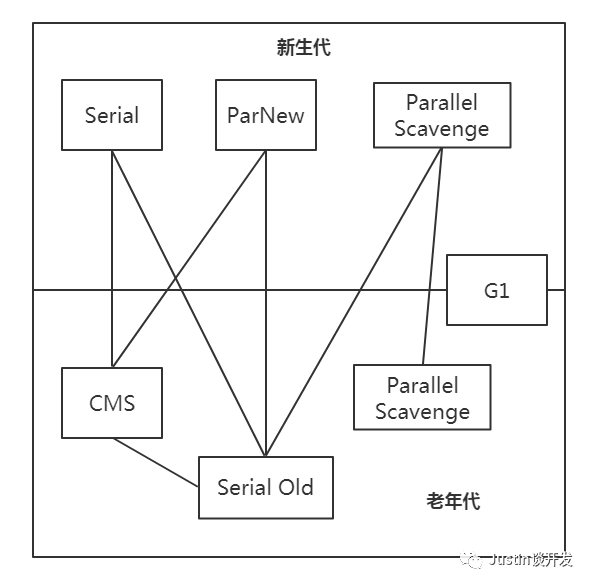

## JVM系列之垃圾收集器

#### **前言**
上节我们谈到了几种垃圾收集算法，今天我们就讲讲关于内存回收的几种具体实现，下面这张图概括了虚拟机中几种垃圾收集器之间的协作关系和应用区域，其中G1是贯穿整个新生代和老年代。下面我们将对每个收集器做个了解和认识，好啦，开始今天的JVM之旅吧。

#### **Serial收集器（新生代）**
串行收集器（单线程收集器），在进行垃圾收集的时候，必须暂停其他所有的工作线程，直到它收集结束，这些动作由虚拟机在后台自动发起和自动完成，在用户不可见的情况下把用户正常工作的线程全程停掉；

当然作为最基本最古老的收集器，Serial也有着优于其他收集器的地方：简单高效，对于单CPU环境，Serial由于没有和其他线程交互的开销，只做收集垃圾一件事，当然效率相比之下比较好，所以，对于运行在client模式下的虚拟机来说，使用Serial收集器还是优先选择的。

#### **ParNew收集器（新生代）**
并行收集器（多线程收集器），使用多个线程同时进行垃圾回收，可以有效的缩短垃圾回收所需的实际时间，除了将Serial串行收集并行化，ParNew并没有其他特殊的地方；

因为在性能上得到大大的提升，ParNew一般都作为Server模式下虚拟机新生代的首选收集器，同时也是新生代并行收集器中唯一一个能和CMS协作的；

使用-XX：+UseConcMarkSweepGC选项就是默认设置新生代收集器为ParNew
使用-XX：+UseParNewGC选项强制指定新生代收集器为ParNew
使用 -XX：ParallelGCThreads参数指定ParNew回收器工作时的线程数量

#### **Parallel Scavenge收集器（新生代）**
并行收集器（可以边收集垃圾先产生垃圾），使用复制算法实现，与其他收集器不同点在于Parallel关注系统的吞吐量，目标是可以达到一个可控制的吞吐量（吞吐量指CPU用于运行用户代码的时间与CPU总耗时时间的比值）；
两个参数用于精确控制吞吐量：

-XX：MaxGCPauseMillis：设置最大垃圾收集停顿时间，可以把虚拟机在GC停顿的时间控制在MaxGCPauseMillis范围内，如果希望减少GC停顿时间可以将MaxGCPauseMillis设置的很小，但是会导致GC频繁，从而增加了GC的总时间，降低了吞吐量

-XX：GCTimeRatio：设置吞吐量大小，它是一个从0到100之间的整数，默认情况下他的取值为99，那么系统将花费不超过1/（1+n）的时间用于垃圾回收，也就是1/（1+99）=1%的时间

**GC自适应调节策略**：Parallel也称为“吞吐量优先”收集器，此外Parallel还有一个开关参数（-XX:+UseAdaptiveSizePolicy），当这个开关打开，就不需要手动指定新生代的大小、Eden与Survivor区的比例、晋升老年代对象大小等，虚拟机会根据当前系统运行情况，动态调整这些参数以提供最合适的停顿时间或者最大吞吐量，这就是GC自适应调节策略。

#### **Serial Old收集器（老年代）**
Serial的老年代版本，串行单线程收集器，使用标记-压缩算法，主要用于在Client模式下使用，如果使用在Server模式下，有2点作用：
用于1.5之前的JDK中与Parallel Scavenge配合使用；
作为老年代CMS的后备方案；

#### **Parallel Old收集器**
Parallel Scavenge的老年代版本，并行多线程收集器，使用标记-压缩算法，在JDK1.6版本之前，如果新生代选择了Parallel Scavenge收集器，老年代除了Serial Old别无选择，很尴尬，1.6之后Parallel Old打破这种尴尬；
此外Parallel Scavenge+Parallel Old组合，在在吞吐量和CPU资源敏感的场景下，实现一个比较高效率的组合

#### **CMS收集器（老年代）**
并行收集器，使用标记-清除算法实现，整个过程分为4个阶段：

**初始标记**：仅仅标记一下GC Roots能直接关联到的对象，速度快

**并发标记**：进行GC Roots追踪过程

**重新标记**：将标记开始这段时间内产生变动的对象重新标记，停顿时间会比初始标记时间长

**并发清除**：将初始标记+重新标记阶段标记的对象一起清除掉

**优点**：并发收集、低停顿

**缺点**：主要有以下三点

- 对CPU资源非常敏感
- 无法收集浮动垃圾（CMS在清理垃圾时，当线程还在运行期间产生的垃圾），可能出现并发收集失败，导致Full GC（老年代GC），如果当浮动垃圾超过老年代垃圾收集阈值就会提前进入Full GC
- 我们之前讲过标记-清除算法有个缺点就是内存碎片问题，所以CMS也存在这个问题，对于这个问题没有彻底解决方案，CMS做了点优化手段CMS有个参数设置-XX：+UseCMSCompactAtFullCollection可以使CMS回收完成之后进行一次碎片整理   
	-XX：CMSFullGCsBeforeCompaction参数可以设置进行多少次CMS回收之后，对内存进行一次压缩

#### **G1收集器**
G1回收器（Garbage First）是在JDK1.7中提出的垃圾回收器，从长期目标来看是为了取代CMS回收器，G1回收器拥有独特的垃圾回收策略，G1属于分代垃圾回收器，区分新生代和老年代，依然有eden和from/to区，它并不要求整个eden区或者新生代、老年代的空间都连
续，他又使用了分区算法，主要具备以下特点：

并行与并发：

- 并行性：G1回收期间可多线程同时工作
- 并发性：G1拥有与应用程序交替执行能力，部分工作可与应用程序同时执行，在整个GC期间不会完全阻塞应用程序

**分代收集**：G1依然是一个分代的收集器，但是他是兼顾新生代和老年代一起工作，之前的垃圾收集器他们或者在新生代工作，或者在老年代工作

**空间整合**：G1在回收过程中，不会像CMS那样在若干次GC后需要进行碎片整理，G1采用了有效复制对象的方式，减少空间碎片，能提供规整的可用内存，有利于程序长时间运行，分配大对象时不会因为无法找到连续空间而提前出发下一次GC

**可预测的停顿**：由于分区的原因，G1可以只选择部分区域进行回收，缩小了回收的范围，提升了性能

G1采用这种把内存化整为零的思路，将内存分为若干区域，每个区域都有单独一套自己处理内存的方案，尽可能的提高收集效率；

G1收集器的运行过程：

**初始标记**——>**并发标记**——>**最终标记**——>**筛选回收**

## 转载
[Justin的后端书架--JVM系列之垃圾收集器](https://mp.weixin.qq.com/s/56-im35LhAyr6vLNs9MEcg)