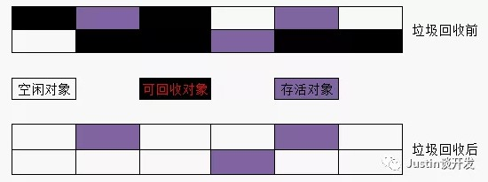
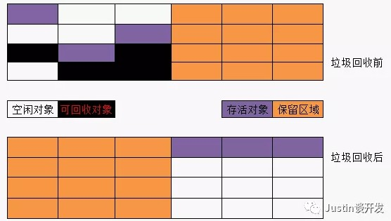
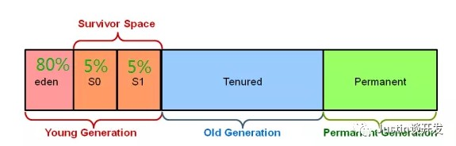
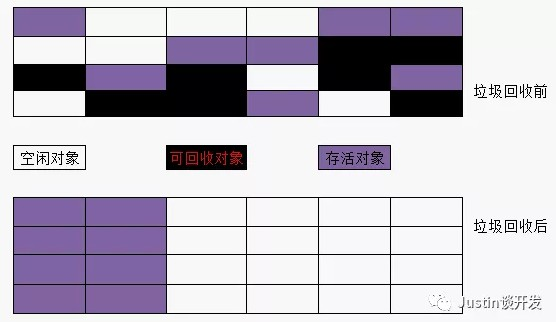
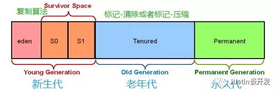

## JVM系列之垃圾收集算法

#### **前言**
上节我们介绍了JVM虚拟机对象的存活判断，提到了GC回收，GC回收指的是将存在内存中的不会再被使用的对象当成垃圾倒掉，垃圾回收算法有很多例如：引用计数，标记清除，复制，分代，分区，那么今天我们就来谈谈Java中这几种垃圾回收算法，OK，让我们开启今天的JVM之旅。

#### **引用计数算法**
引用计数是一个比较古老的算法，核心是：在对象被其他对象所引用时计数器加1，而当引用失效时则减1，但是这种方式有非常严重的问题：无法处理循环引用的情况，还有就是每次进行加减操作比较浪费系统性能。

#### **标记-清除算法**
标记-清除算法分为标记和清除两个阶段：首先标记出所有需要回收的对象，然后统一回收掉所有标记的对象，如下图所示：

**缺点**：存在空间碎片问题，从上图我们能看出来垃圾收集后，空闲对象块不是连续的，产生了大量的不连续碎片，这种情况下，当程序在后期运行过程中需要分配较大对象时，无法找到足够的连续内存，而不得不提前触发垃圾回收，不连续的内存空间的工作效率要低于连续的内存空间。

#### **复制算法**
为了解决标记-清除的内存碎片效率问题，引出了复制算法，核心思想为：将内存等分成2块，每次只使用其中一块在垃圾回收时，将正在使用的内存中的存留对象复制到未被使用的内存块中去，之后去清除之前正在使用的内存块中所有的对象，反复去交换俩个内存的角色，完成垃圾收集，此算法不需要考虑内存碎片问题，如下图所示：

**缺点**：从上图我们可以看出来，这样虽然不存在内存碎片问题，所有可用内存都是连续的，但是我们也会发现，真正可用的内存其实只有总内存1/2（Java中新生代的from和to空间就是使用这个算法）。

**扩展（Java新生代垃圾回收）**：新生代的对象生死周期比较短，新生代将内存分为一块较大的Eden区和两块较小的Survivor区，每次使用Eden和其中的一块S1，当垃圾回收时，将Eden和S1中还存活的对象一起拷贝到另一块S2上，最后清除掉Eden和S1区，HotSpot默认Eden:S=8:1

#### **标记-压缩算法**
标记-压缩算法是在标记-清除的基础上做的优化，也是先标记，但是标记完不是直接清理，而是先压缩，把存活的对象压缩到内存的一端，然后再将存活对象端边界以为的内存对象直接清理掉，减少了空间碎片问题，同时也解决了复制算法的1/2内存牺牲问题（Java老年代就是使用该算法）。

#### **分代收集算法**
分代收集算法是一种采用比较多的算法，这种算法其实本质上并没有特殊的地方，核心是：根据对象的存活周期不同，将内存划分为N块，然后根据每个内存的特点使用不同的算法，

应用到Java虚拟机中就是：一般将Java堆分为新生代和老年代，这样就可以根据不同年代的特点采用最合适的收集算法，在新生代每次收集有大量对象死亡，只有少量对象存活，比较适合复制算法（牺牲少量存活对象的复制为代价就能完成收集），老年代中因为对象存活率高，没有额外的空间使用，就必须使用标记-清除或者标记-压缩算法来进行回收。

#### **分区算法**
其主要就是将整个内存分为N多个小的独立空间，每个小空间都可以独立使用，这样细粒度的控制一次回收多少个小空间和哪些小空间，而不是对整个空间进行GC，从而提升性能，并减少了GC的停顿时间。

## 转载
[Justin的后端书架--JVM系列之垃圾收集算法](https://mp.weixin.qq.com/s/AZ0-XEohC5qA2xwF8c3zuA)