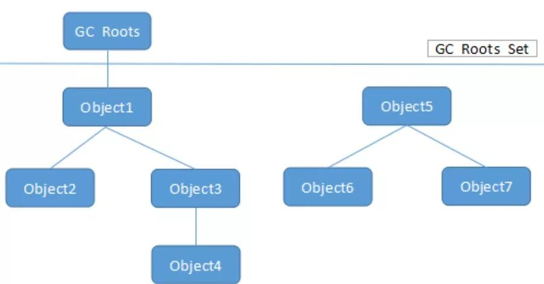
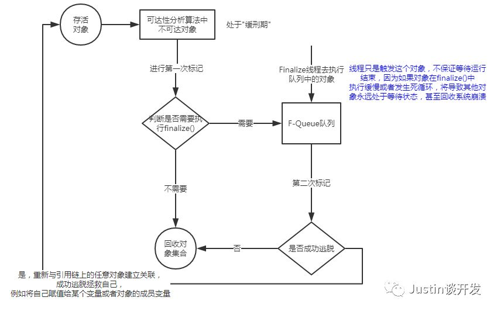

## JVM系列之对象是否存活

#### 前言
之前我们讲过了JVM的内存区域和内存溢出，今天我们谈下处于JVM中的对象的问题，这些对象是否存活，如何判断，又如何去处理呢，带着这些疑问我们开启今天的JVM之旅。

#### 如何判断对象是否存活？
- **引用计数算法**： 给对象中添加一个引用计数器，每当有一个地方引用它时，计数器的值就+1，当引用失效时，计数器的值就-1；当计数器的值为0时，就表示该对象为不可用对象；
	
		
	优点： 引用计数算法实现简单，效率也很高
	缺点： 很难解决对象之间相互循环引用时的对象存活判断，
		  例如对象A和B相互引用对方，即使A和B永远都不会再被访问，但是因为AB彼此持有对方的引用导致，
		  AB的计数器永远不会为0，也就不会死亡，引用计数器无法通知GC收集器回收它们，正是因为这一点，
          主流的JVM都没有选用引用计数法来管理内存。	

- **可达性分析算法**： 通过一系列的GC Root对象作为起点，从这些起点出发向下搜索，搜索所走过的痕迹称为引用链，当一个对象到起点GC Root没有任何引用链相连接时，就说明该对象是不可用的

如图: 1234到GC Root都是可达的因此都是可用的，567都是不可用的。

- **扩展什么是引用**： 如果引用类型的数据中存储的数值代表的是另一块内存的起始地址，就称这块内存为一个引用，在这种定义下，一个对象只有被引用和未被引用两种状态，当我们遇到下面这种对象就显得有心无力了：当内存空间足够时，对象保留，内存紧张时，则被抛弃； 
	
对于这种对象，Java在1.2版本之后对引用进行了加强，提出了强引用、软引用、弱引用和虚引用4种引用类型，引用强度依次递减，下面我们将依次介绍：

- **强引用**：在代码中普通存在的对象，例如直接new出来的对象，这类对象只要强引用还存在，垃圾收集器永远不会回收被引用的对象；
- **软引用**：描述一些还有用但是并非必需的对象，这类对象在将要发生内存溢出之前，会被列进回收范围之中进行第二次回收，如果在此次回收中还是没有足够的内存，就会抛出内存溢出异常（SoftReference）；
- **弱引用**：描述一些非必需的对象，这类对象只能存活到下一次垃圾回收之前，当垃圾收集器回收时，无论当前内存是否足够，被弱引用关联的对象都会被回收掉（WeakReference）；
- **虚引用**：最弱的一个引用类型，被虚引用关联的对象完全不会影响其生存时间，可以理解为没有引用一样，但是又有点区别，区别在于，弱引用关联的对象在被收集器回收的时候能收到一个系统回收通知（PhantomReference）；

#### 对象死亡的过程？

注释：finalize()方法可以使用try-finally替换

#### 方法区如何回收？

方法区（HotSpot永久代）回收其实是一个不常被关注的地方，主要原因在于两点，第一：虚拟机规范中不要求对方法区进行回收；第二点：方法区回收的性价比比较低，回收效率比较低。但是我们还是做个了解比较好，接下来我们就讲下方法区的回收。

主要分为两个方面：废弃常量和无用的类

**废弃常量**： 如果常量池中的某个常量不被任何对象引用，也没有任何地方引用这个字面量，则会在垃圾回收的时候，被清理出常量池（常量池中其他类、方法、字段也类似）；

**无用的类**： 无用的类需要满足下面3点才会被回收

	- 该类所有的实例都已经被回收，即堆中不存在该类的任何实例
	- 加载该类的ClassLoader已经被回收
	- 该类对应的class对象没有在任何地方被引用，无法在任何地方通过反射访问该类的方法

当无用的类满足上述3点即满足回收条件，但是具体是否被回收还可以由-Xnoclassgc参数来控制

## 转载
[ Justin的后端书架--JVM系列之对象是否存活](https://mp.weixin.qq.com/s/x8dTLklLHpKFkffyttgCZA)