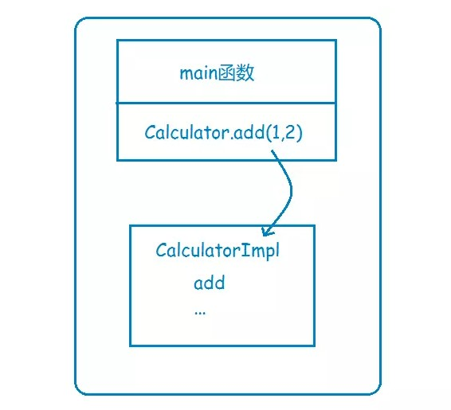
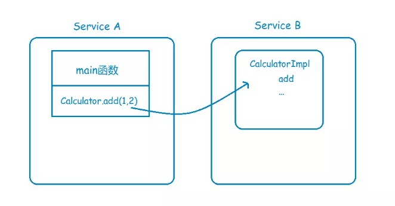
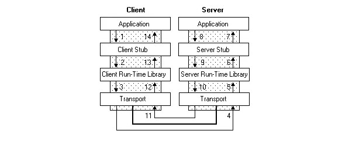

## 什么是RPC? ##

说起RPC，就不能不提到分布式，这个促使RPC诞生的领域。

假设你有一个计算器接口，Calculator，以及它的实现类CalculatorImpl，那么在系统还是**单体应用**时，你要调用Calculator的add方法来执行一个加运算，直接new一个CalculatorImpl，然后调用add方法就行了，这其实就是非常普通的**本地函数调用**，因为在**同一个地址空间**，或者说在同一块内存，所以通过方法栈和参数栈就可以实现。



现在，基于高性能和高可靠等因素的考虑，你决定将系统改造为分布式应用，将很多可以共享的功能都单独拎出来，比如上面说到的计算器，你单独把它放到一个服务里头，让别的服务去调用它。



这下问题来了，服务A里头并没有CalculatorImpl这个类，那它要怎样调用服务B的CalculatorImpl的add方法呢？

有同学会说，可以模仿B/S架构的调用方式呀，在B服务暴露一个Restful接口，然后A服务通过调用这个Restful接口来间接调用CalculatorImpl的add方法。

很好，这已经很接近RPC了，不过如果是这样，那每次调用时，是不是都需要写一串发起http请求的代码呢？比如httpClient.sendRequest...之类的，能不能像本地调用一样，去发起远程调用，让使用者感知不到远程调用的过程呢，像这样：

```java
@Reference
private Calculator calculator;

...

calculator.add(1,2);

...
```

这时候，有同学就会说，用**代理模式**呀！而且最好是结合Spring IoC一起使用，通过Spring注入calculator对象，注入时，如果扫描到对象加了@Reference注解，那么就给它生成一个代理对象，将这个代理对象放进容器中。而这个代理对象的内部，就是通过httpClient来实现RPC远程过程调用的。

可能上面这段描述比较抽象，不过这就是很多RPC框架要解决的问题和解决的思路，比如阿里的Dubbo。

总结一下，**RPC要解决的两个问题**：

1. 解决分布式系统中，服务之间的调用问题。
2. 远程调用时，要能够像本地调用一样方便，让调用者感知不到远程调用的逻辑。

## 如何实现一个RPC ##
实际情况下，RPC很少用到http协议来进行数据传输，毕竟我只是想传输一下数据而已，何必动用到一个文本传输的应用层协议呢，我为什么不直接使用**二进制传输**？比如直接用Java的Socket协议进行传输？

不管你用何种协议进行数据传输，**一个完整的RPC过程，都可以用下面这张图来描述**：



以左边的Client端为例，Application就是rpc的调用方，Client Stub就是我们上面说到的代理对象，也就是那个看起来像是Calculator的实现类，其实内部是通过rpc方式来进行远程调用的代理对象，至于Client Run-time Library，则是实现远程调用的工具包，比如jdk的Socket，最后通过底层网络实现实现数据的传输。

这个过程中最重要的就是**序列化**和**反序列化**了，因为数据传输的数据包必须是二进制的，你直接丢一个Java对象过去，人家可不认识，你必须把Java对象序列化为二进制格式，传给Server端，Server端接收到之后，再反序列化为Java对象。

## RPC vs RMI ##

严格来说这两者也不是一个维度的。

RMI是Java提供的一种访问远程对象的协议，是已经实现好了的，可以直接用了。

而RPC呢？人家只是一种编程模型，并没有规定你具体要怎样实现，**你甚至都可以在你的RPC框架里面使用RMI来实现数据的传输**，比如Dubbo：Dubbo - rmi协议

## RPC没那么简单 ##

**要实现一个RPC不算难，难的是实现一个高性能高可靠的RPC框架。**

比如，既然是分布式了，那么一个服务可能有多个实例，你在调用时，要如何获取这些实例的地址呢？

这时候就需要一个服务注册中心，比如在Dubbo里头，就可以使用Zookeeper作为注册中心，在调用时，从Zookeeper获取服务的实例列表，再从中选择一个进行调用。

那么选哪个调用好呢？这时候就需要负载均衡了，于是你又得考虑如何实现复杂均衡，比如Dubbo就提供了好几种负载均衡策略。

这还没完，总不能每次调用时都去注册中心查询实例列表吧，这样效率多低呀，于是又有了缓存，有了缓存，就要考虑缓存的更新问题，blablabla......

你以为就这样结束了，没呢，还有这些：

- 客户端总不能每次调用完都干等着服务端返回数据吧，于是就要支持异步调用；
- 服务端的接口修改了，老的接口还有人在用，怎么办？总不能让他们都改了吧？这就需要版本控制了；
- 服务端总不能每次接到请求都马上启动一个线程去处理吧？于是就需要线程池；
- 服务端关闭时，还没处理完的请求怎么办？是直接结束呢，还是等全部请求处理完再关闭呢？
- ......

如此种种，都是一个优秀的RPC框架需要考虑的问题。

当然，接下来我们还是先实现一个简单的RPC，再在上面一步步优化！

传送门： [如何实现一个简单的RPC](https://www.jianshu.com/p/5b90a4e70783)

## 如何实现一个简单的RPC ##

那么如何实现远程过程调用，也就是RPC呢，一个完整的RPC流程，可以用下面这张图来描述：


其中左边的Client，对应的就是前面的Service A，而右边的Server，对应的则是Service B。下面一步一步详细解释一下。

1. Service A的应用层代码中，调用了Calculator的一个实现类的add方法，希望执行一个加法运算；
2. 这个Calculator实现类，内部并不是直接实现计算器的加减乘除逻辑，而是通过远程调用Service B的RPC接口，来获取运算结果，因此称之为**Stub**；
3. Stub怎么和Service B建立远程通讯呢？这时候就要用到**远程通讯工具**了，也就是图中的**Run-time Library**，这个工具将帮你实现远程通讯的功能，比如Java的**Socket**，就是这样一个库，当然，你也可以用基于Http协议的**HttpClient**，或者其他通讯工具类，都可以，**RPC并没有规定说你要用何种协议进行通讯**；
4. Stub通过调用通讯工具提供的方法，和Service B建立起了通讯，然后将请求数据发给Service B。需要注意的是，由于底层的网络通讯是基于**二进制格式**的，因此这里Stub传给通讯工具类的数据也必须是二进制，比如calculator.add(1,2)，你必须把参数值1和2放到一个Request对象里头（这个Request对象当然不只这些信息，还包括要调用哪个服务的哪个RPC接口等其他信息），然后**序列化**为二进制，再传给通讯工具类，这一点也将在下面的代码实现中体现；
5. 二进制的数据传到Service B这一边了，Service B当然也有自己的通讯工具，通过这个通讯工具接收二进制的请求；
6. 既然数据是二进制的，那么自然要进行**反序列化**了，将二进制的数据反序列化为请求对象，然后将这个请求对象交给Service B的Stub处理；
7. 和之前的Service A的Stub一样，这里的Stub也同样是个“假玩意”，它所负责的，只是去解析请求对象，知道调用方要调的是哪个RPC接口，传进来的参数又是什么，然后再把这些参数传给对应的RPC接口，也就是Calculator的实际实现类去执行。很明显，如果是Java，那这里肯定用到了**反射**。
8. RPC接口执行完毕，返回执行结果，现在轮到Service B要把数据发给Service A了，怎么发？一样的道理，一样的流程，只是现在Service B变成了Client，Service A变成了Server而已：Service B反序列化执行结果->传输给Service A->Service A反序列化执行结果 -> 将结果返回给Application，完毕。

## RPC代码实现 ##

首先是Client端的应用层怎么发起RPC

```java
public class ConsumerApp {  
    public static void main(String[] args) {
        Calculator calculator = new CalculatorRemoteImpl();
        int result = calculator.add(1, 2);
    }
}
```

**通过一个CalculatorRemoteImpl，我们把RPC的逻辑封装进去了，客户端调用时感知不到远程调用的麻烦**。下面再来看看CalculatorRemoteImpl，代码有些多，但是其实就是把上面的2、3、4几个步骤用代码实现了而已，CalculatorRemoteImpl： 


```java
public class CalculatorRemoteImpl implements Calculator {
    public int add(int a, int b) {
        List<String> addressList = lookupProviders("Calculator.add");
        String address = chooseTarget(addressList);
        try {
            Socket socket = new Socket(address, PORT);

            // 将请求序列化
            CalculateRpcRequest calculateRpcRequest = generateRequest(a, b);
            ObjectOutputStream objectOutputStream = new ObjectOutputStream(socket.getOutputStream());

            // 将请求发给服务提供方
            objectOutputStream.writeObject(calculateRpcRequest);

            // 将响应体反序列化
            ObjectInputStream objectInputStream = new ObjectInputStream(socket.getInputStream());
            Object response = objectInputStream.readObject();

            if (response instanceof Integer) {
                return (Integer) response;
            } else {
                throw new InternalError();
            }

        } catch (Exception e) {
            log.error("fail", e);
            throw new InternalError();
        }
    }
}

```


add方法的前面两行，lookupProviders和chooseTarget，可能大家会觉得不明觉厉。

分布式应用下，一个服务可能有多个实例，比如Service B，可能有ip地址为198.168.1.11和198.168.1.13两个实例，lookupProviders，其实就是在寻找要调用的服务的实例列表。在分布式应用下，通常会有一个**服务注册中心**，来提供查询实例列表的功能。

查到实例列表之后要调用哪一个实例呢，只时候就需要chooseTarget了，其实内部就是一个**负载均衡策略**。

由于我们这里只是想实现一个简单的RPC，所以暂时不考虑服务注册中心和负载均衡，因此代码里写死了返回ip地址为127.0.0.1。

代码继续往下走，我们这里用到了Socket来进行远程通讯，同时利用**ObjectOutputStream**的writeObject和**ObjectInputStream**的readObject，来实现序列化和反序列化。

最后再来看看Server端的实现，和Client端非常类似，ProviderApp：

```java
public class ProviderApp {
    private Calculator calculator = new CalculatorImpl();

    public static void main(String[] args) throws IOException {
        new ProviderApp().run();
    }

    private void run() throws IOException {
        ServerSocket listener = new ServerSocket(9090);
        try {
            while (true) {
                Socket socket = listener.accept();
                try {
                    // 将请求反序列化
                    ObjectInputStream objectInputStream = new ObjectInputStream(socket.getInputStream());
                    Object object = objectInputStream.readObject();

                    log.info("request is {}", object);

                    // 调用服务
                    int result = 0;
                    if (object instanceof CalculateRpcRequest) {
                        CalculateRpcRequest calculateRpcRequest = (CalculateRpcRequest) object;
                        if ("add".equals(calculateRpcRequest.getMethod())) {
                            result = calculator.add(calculateRpcRequest.getA(), calculateRpcRequest.getB());
                        } else {
                            throw new UnsupportedOperationException();
                        }
                    }

                    // 返回结果
                    ObjectOutputStream objectOutputStream = new ObjectOutputStream(socket.getOutputStream());
                    objectOutputStream.writeObject(new Integer(result));
                } catch (Exception e) {
                    log.error("fail", e);
                } finally {
                    socket.close();
                }
            }
        } finally {
            listener.close();
        }
    }
}
```

Server端主要是通过ServerSocket的accept方法，来接收Client端的请求，接着就是反序列化请求->执行->序列化执行结果，最后将二进制格式的执行结果返回给Client。

就这样我们实现了一个简陋而又详细的RPC。 
说它简陋，是因为这个实现确实比较挫，在下一小节会说它为什么挫。
说它详细，是因为它一步一步的演示了一个RPC的执行流程，方便大家了解RPC的内部机制。

## 转载至 ##
[如何给老婆解释什么是RPC](https://www.jianshu.com/p/2accc2840a1b)
[ 如何实现一个简单的RPC](https://www.jianshu.com/p/5b90a4e70783)