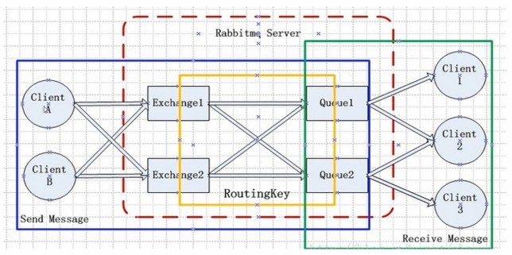
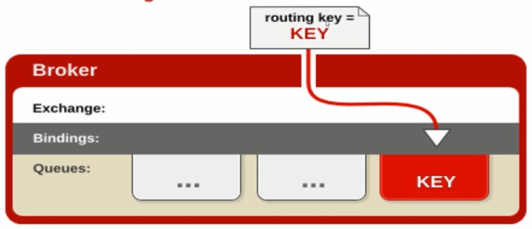

## 第一章 主流的消息中间件
#### ActiveMQ
> ActiveMQ是Apache出品，最流行的，能力强劲的开源消息总线，并且它是一个完全支持JMS规范的消息中间件  
> 其丰富的API、多重集群构建模式使得它成为业界老牌消息中间件，在中小型企业中应用广泛  
> MQ衡量指标：服务性能、数据存储、集群架构
#### ActiveMQ的集群模式


#### Kafka
> Kafka是LinkedIn开源的分布式发布-订阅消息系统，目前归属于Apache顶级项目。Kafka主要**特点**是基于Pull模式来处理消息消费，追求高吞吐量，一开始的目的就是用于日志收集和传输。0.8版本开始支持复制，不支持事务，对消息的重复，丢失，错误没有严格要求，适合产生大量数据的互联网服务的数据收集业务。

#### Kafka的集群模式


#### RocketMQ
> RocketMQ是阿里开源的消息中间件，目前也已经孵化为Apache顶级项目，它是纯Java开发，具有高吞吐量、高可用性、适合大规模分布式系统应用的特点。RocketMQ思路起源于Kafka，它对消息的可靠传输以及事务性做了优化，目前在阿里集团被广泛应用于交易、充值、流计算、消息推送、日志流式处理、binglog分发等场景。

#### RocketMQ的集群模式


#### RabbitMQ
> RabbitMQ是使用Erlang语言开发的开源消息队列系统，基于AMQP协议来实现。AMQP的主要**特征**是**面向消息**、**队列**、**路由（包括点对点和发布/订阅）**、**可靠性**、**安全**。AMQP协议更多用在企业系统内，对**数据一致性**，**稳定性**和**可靠性**要求很高的场景，对性能和吞吐量的要求还在其次。

#### RabbitMQ集群模式


## 第二章 RabbitMQ核心概念及AMQP协议

#### RabbitMQ是什么
> RabbitMQ是一个开源的消息代理和队列服务器，用来通过普通协议在完全不同的应用之间共享数据，RabbitMQ是使用Erlang语言来编写的，并且RabbitMQ是基于AMQP协议的。

#### RabbitMQ功能特性
1. 开源、性能优秀、稳定性保障
2. 提供可靠性消息投递模式(confirm)、返回模式(return)
3. 与SpringAMQP完美的整合，API丰富
4. 集群模式丰富、表达式配置、HA模式、镜像队列模型
5. 保证数据不丢失的前提做到高可靠性、可用性

#### RabbitMQ高性能的原因
1. Erlang语言最初基于交换机领域的架构模式，使得RabbitMQ在Broker之间进行数据交互的性能是非常优秀的。
2. Erlang的有点：Erlang有着和原生Socket一样的延迟

#### 什么是AMQP高级消息队列协议?
> AMQP全称：Advanced Message Queuing Protocol(高级消息队列协议)，是具有现代特征的二进制协议。是一个提供统一消息服务的应用层标准高级消息队列协议，是应用层协议的一个开放标准，为面向消息的中间件设计

#### AMQP协议模型


#### AMQP的核心概念
1. **Server**： 又称Broker，接受客户端的连接，实现AMQP实体服务
2. **Connection**： 连接，应用程序与Broker的网络连接
3. **Channel**： 网络信道，几乎所有的操作都是在Channel中进行，Channel是进行消息读写的通道。客户端可建立多个Channel，每一个Channel代表一个会话任务
4. **Message**： 消息，服务器和应用程序之间传送的数据，由Properties和Body组成。Properties可以对消息进行修饰，比如消息的优先级，延迟等高级特性，Body则是消息体内容
5. **Virtual host**： 虚拟地址，用于进行逻辑隔离，最上层的消息路由。一个Virtual Host里面可以有若干个Exchange和Queue，同一个Virtual Host里面不能有相同名称的Exchange或Queue
6. **Exchange**： 交换机，接收消息，根据路由键(routing key)转发消息到绑定的队列
7. **Binding**： Exchange和Queue之间的虚拟连接，binding中可以包含routing key
8. **RoutingKey**： 一个路由规则，虚拟机可用它来确定如何路由一个特定消息
9. **Queue**： 也成为了Message Queue，消息队列，保存消息并将它们转发给消费者

#### RabbitMQ的整体架构


#### RabbitMQ的消息如何流转

- 生产者生产出一条消息，并将消息投递到Exchange(交换机)
- Exchange根据routingKey的路由规则，将Exchange和Queue建立一个binding，通过Routingkey
- 然后把消息路由到某一个Queue
- 消费者就可以从指定的Queue中消息消息

#### RabbitMQ的使用
- **服务的启动**： rabbitmq-server start &
- **服务的停止**： rabbitmqctl stop_app
- **管理插件**： rabbitmq-plugins enable rabbitmq_management
- **访问地址**： [http://10.125.28.253:15672/](http://10.125.28.253:15672/)

#### RabbitMQ命令行操作
- rabbitmqctl start_app： 启动应用
- rabbitmqctl stop_app： 关闭应用
- rabbitmqctl status： 查看节点状态
- rabbitmqctl add_user username password：添加用户
- rabbitmqctl list_users：列出所有用户
- rabbitmqctl delete_user username：删除用户
- rabbitmqctl clear_permissions -p vhostpath username：清除用户权限
- rabbitmqctl list_user_permissions username：列出用户权限
- rabbitmqctl change_password username password：修改密码
- rabbitmqctl set_permissions -p vhostpath username " .* " " .* " " .* "： 设置用户权限
- rabbitmqctl add_vhost vhostpath： 创建虚拟主机
- rabbitmqctl list_vhosts： 列出所有虚拟主机
- rabbitmqctl list_permissions -p vhostpath： 列出虚拟主机上的所有权限
- rabbitmqctl delete_vhost vhostpath： 删除虚拟主机
- rabbitmqctl list_queues： 查看所有队列信息
- rabbitmqctl -p vhostpath purge_queue blue： 清除队列里的消息
- rabbitmqctl reset： 移除所有数据，要在rabbitmqctl stop_app之后使用
- rabbitmqctl join_cluster <clusternode> [--ram]： 组成集群命令
- rabbitmqctl cluster_status： 查看集群状态
- rabbitmqctl change_cluster_node_type disc|ram： 修改集群节点的存储形式
- rabbitmqctl forget_cluster_node [--offline]： 忘记节点(摘除节点)
- rabbitmqctl rename_cluster_node oldnode1 newnode1 [oldnode2] [newnode2...]：修改节点名称


#### 消息的生产和消费入门实例
- ConnectionFactory：获取连接工厂
- Connection：获取连接(根据连接工厂实例对象获取一个连接)
- Channel：数据通信信道，可发送和接收消息(根据连接，创建一个Channel)
- Queue： 具体的消息存储队列
- Producer&Consumer：生产者和消费者

1. **生产者**
```
public class Producer {

	public static void main(String[] args) throws Exception {
		// 1、创建一个ConnectionFactory实例，并配置相关属性
		ConnectionFactory connectionFactory = new ConnectionFactory();
		connectionFactory.setHost("10.125.28.253");
		connectionFactory.setPort(5672);
		connectionFactory.setUsername("zxc");
		connectionFactory.setPassword("zxc123");
		connectionFactory.setVirtualHost("/");
		// 2、通过连接工厂创建一个连接
		Connection connection = connectionFactory.newConnection();
		// 3、通过Connection创建一个Channel
		Channel channel = connection.createChannel();
		// 4、通过Channel发送数据
		for (int i=0; i<5; i++) {
			String msg = "Hello RabbitMQ!";
			channel.basicPublish("", "test001", null, msg.getBytes());
		}
		// 5、记得要关闭相关连接
		channel.close();
		connection.close();
	}
}
```
2. **消费者**
```
public class Consumer {

	public static void main(String[] args) throws Exception {
		// 1、创建一个ConnectionFactory实例，并配置相关属性
		ConnectionFactory connectionFactory = new ConnectionFactory();
		connectionFactory.setHost("10.125.28.253");
		connectionFactory.setPort(5672);
		connectionFactory.setUsername("zxc");
		connectionFactory.setPassword("zxc123");
		connectionFactory.setVirtualHost("/");
		// 2、通过连接工厂创建一个连接
		Connection connection = connectionFactory.newConnection();
		// 3、通过Connection创建一个Channel
		Channel channel = connection.createChannel();
		// 4、声明(创建)一个队列
		String queueName = "test001";
		channel.queueDeclare(queueName, true, false, false, null);
		// 5、创建消费者
		DefaultConsumer consumer = new DefaultConsumer(channel) {

			@Override
			public void handleDelivery(String consumerTag, Envelope envelope, 
					BasicProperties properties, byte[] body) throws IOException {
				try {
					System.out.println("consumerTag: " + consumerTag);
					System.out.println("envelope : " + envelope.toString());
					System.out.println("properties : " + properties.toString());
					System.out.println("监听到的消息内容：" + new String(body));
				} catch (Exception e) {
					e.printStackTrace();
				}
			}
			
		};
		// 6、设置Channel
		channel.basicConsume(queueName, true, consumer);
		
	}
}
```

#### Exchange交换机
- Exchange： 接收消息，并根据路由键(RoutingKey)转发消息给其所绑定的队列

##### 交换机属性
- Name：交换机名称
- Type：交换机类型 direct、topic、fanout、headers
- Durability：是否需要持久化，true为持久化
- Auto Delete：当最后一个绑定到Exchange上的队列删除后，自动删除该Exchange
- Internal：当前Exchange是否用于RabbitMQ内部使用，默认为false
- Arguments：扩展参数，用于扩展AMQP协议自定义使用

##### 1、Direct Exchange
> 所有发送到Direct Exchange的消息被转发到RoutingKey中指定的Queue  
  
<font color=red>注意：</font>Direct模式可以使用RabbitMQ自带的Exchange：default Exchange，所以不需要将Exchange进行任何绑定(binding)操作，消息传递时，RoutingKey必须完全匹配才会被队列接收，否则该消息会被抛弃


##### 2、Topic Exchange
> 所有发送到Topic Exchange的消息会被转发到所有关心RoutingKey中指定Topic的Queue上  
> Exchange将RoutingKey和某个Topic进行模糊匹配，此时需要绑定一个Topic

<font color=red>注意：</font>可以使用通配符进行模糊匹配
> 符号：“#” 匹配一个或多个词  
> 符号：“ * ” 只匹配一个词  
> 如：“log.#” 能够匹配到“log.info.oa”  
> “log.*” 只会匹配到“log.error”  


##### 2、Fanout Exchange
> 不处理路由键，只需要简单的将队列绑定到交换机上  
> 发送到交换机的消息都会被转发到与该交换机绑定的所有队列上  
> Fanout交换机转发消息是最快的


##### Binding-绑定
> Exchange和Exchange，Queue之间的连接关系  
> Binding中可以包含RoutingKey或者参数  

##### Queue-消息队列
> 消息队列、实际存储消息数据  
> Durability：是否持久化，Durable:是，Transient：否  
> Auto Delete：如果设置true，代表当最后一个监听被移除之后，该Queue会自动被删除  

##### Message-消息
> 服务器和应用程序之间传送的数据  
> 本质上就是一段数据，由Properties和Payload(Body)组成  
> 常用属性：delivery mode(用于做消息持久化delivery_mode=2)，headers（自定义属性）  
> 其他属性：content_type(消息内容格式)， content_encoding， priority，correlation_id（用于关联RPC的请求与应答），reply_to（一般用于RPC过程，消息处理返回结果队列）， expiration，message_id，timestamp，type，user_id，app_id，cluster_id

##### Virtual host-虚拟主机
> 虚拟地址，用于进行逻辑隔离，最上层的消息路由  
> 一个Virtual Host里面可以有若干个Exchange和Queue  
> 同一个Virtual Host里面不能有相同名称的Exchange或Queue


## 第三章 RabbitMQ的高级特性

#### 如何保障消息100%的投递成功？

##### 什么生产端的可靠性投递？
> 保障消息的成功发出  
> 保障MQ节点的成功接收  
> 发送端收到MQ节点(Broker)确认应答  
> 完善的消息进行补偿机制  

##### 如何解决生产端-可靠性投递

1. 消息落库，对消息状态进行打标


**消息落库步骤**

	1. 写入数据库，可能涉及多个库，业务库，消息库
	2. 发送消息
	3. 消息确认
	4. 更新数据库消息状态
	5. 定时任务获取数据库消息状态
	6. 重试发送
	7. 重试数量大于 3 次，修改状态
2. 消息的延迟投递，做二次确认，回调检查


**延迟投递：** 如果再高并发的情况下，消息就不要入库了，延迟投递，可以不保证首次100%的成功，但是一定要保证性能。  
	
	1. 首次发送，一定等到业务数据入库之后再发送消息，Upstream serivce上游服务
	2. 延迟发送刚发送消息的检查消息
	3. 当消费者消费消息
	4. 消息消费成功之后，发送一个确认消费消息
	5. CallBack服务收到消费者的确认消息，消费成功之后，做消息的持久化存储
	6. CallBack服务检查，处理第二步发送的检查消息，检查数据库是否有处理成功，如果处理成功了，那么就不用处理任何事情，如果处理失败了，Callback服务再通知Upstream服务再次发送消息。

#### 幂等性概念

##### 什么是幂等性？
> 我们可以借鉴数据库的乐观锁机制：比如我们执行一条更新库存的SQL语句 UPDATE T_REPS SET COUNT = COUNT - 1, VERSION=VERSION + 1 WHERE VERSION=1

##### 消费端-幂等性保障
&emsp;在海量订单产生的业务高峰期，如何避免消息的重复消息问题？
> 消费端实现幂等性，就意味着，我们的消息永远不会消费多次，即使我们收到了多条消息

**业界主流的幂等性操作**：
1. 唯一ID + 指纹码机制，利用数据库主键实现去重
	1. SELECT COUNT(1) FROM T_ORDER WHERE ID=唯一ID + 指纹码
	2. 好处：实现简单
	3. 坏处：高并发下有数据库写入的性能瓶颈
	4. 解决方案：根据ID进行分库分表进行算法路由
2. 利用Redis的原子性实现去重
	1. 利用Redis进行幂等，需要考虑的问题
	2. 我们是否要进行数据落库，如果落库的话，关键解决的问题是数据库和缓存如何做到原子性
	3. 如果不进行落库，那么都存储到缓存中，如何设置定时同步的策略

#### Confirm消息确认机制
> 1、消息的确认，是指生产者投递消息后，如果Broker收到消息，则会给生产者一个应答  
> 2、生产者进行接收应答，用来确定这条消息是否正常的发送到Broker，这种方式也是消息的可靠性投递的核心保障

##### Confirm确认消息流程解析


    1. 在channel上开启确认模式：channel.confirmSelect()
	2. 在channel上添加监听：addConfirmListener，监听成功和失败的返回结果，根据具体的结果对消息进行重新发送，或记录日志等后续处理

##### Confirm确认消息-示例代码
1. Producer-生产者
```
public class Producer {

	public static void main(String[] args) throws Exception {
		// 1、创建一个ConnectionFactory实例，并配置
		ConnectionFactory connectionFactory = new ConnectionFactory();
		connectionFactory.setHost("10.125.28.253");
		connectionFactory.setPort(5672);
		connectionFactory.setUsername("zxc");
		connectionFactory.setPassword("zxc123");
		connectionFactory.setVirtualHost("/");
		// 2、通过连接工厂创建一个连接
		Connection connection = connectionFactory.newConnection();
		// 3、通过Connection创建一个Channel
		Channel channel = connection.createChannel();
		
		// 4、指定消息的投递模式：消息的确认模式
		channel.confirmSelect();
		
		// 5、声明
		String exchangeName = "test_confirm_exchange";
		String routingKey = "confirm.save";
		// 6、通过Channel发送数据
		String msg = "Hello RabbitMQ Send Confirm Message!";
		channel.basicPublish(exchangeName, routingKey, null, msg.getBytes());
		
		// 7、添加一个监听
		channel.addConfirmListener(new ConfirmListener() {
			
			@Override
			public void handleNack(long deliveryTag, boolean multiple) throws IOException {
				System.out.println("-------No Ack!---------deliveryTag:" + deliveryTag);
			}
			
			@Override
			public void handleAck(long deliveryTag, boolean multiple) throws IOException {
				System.out.println("-------Ack!---------deliveryTag:" + deliveryTag);
			}
		});
		
		// 5、记得要关闭相关连接
//		channel.close();
//		connection.close();
	}
}
```
2. Consumer-消费者
```
public class Consumer {

	public static void main(String[] args) throws Exception {
		// 1、创建一个ConnectionFactory实例，并配置
		ConnectionFactory connectionFactory = new ConnectionFactory();
		connectionFactory.setHost("10.125.28.253");
		connectionFactory.setPort(5672);
		connectionFactory.setUsername("zxc");
		connectionFactory.setPassword("zxc123");
		connectionFactory.setVirtualHost("/");
		// 2、通过连接工厂创建一个连接
		Connection connection = connectionFactory.newConnection();
		// 3、通过Connection创建一个Channel
		Channel channel = connection.createChannel();
		// 4、声明(创建)一个队列
		String exchangeName = "test_confirm_exchange";
		String routingKey = "confirm.#";
		String queueName = "test_confirm_queue";
		
		channel.exchangeDeclare(exchangeName, "topic", true, false, false, null);
		channel.queueDeclare(queueName, true, false, false, null);
		channel.queueBind(queueName, exchangeName, routingKey);
		
		// 5、创建消费者
		DefaultConsumer consumer = new DefaultConsumer(channel) {

			@Override
			public void handleDelivery(String consumerTag, Envelope envelope, 
					BasicProperties properties, byte[] body) throws IOException {
				try {
					System.out.println("consumerTag: " + consumerTag);
					System.out.println("envelope : " + envelope.toString());
					System.out.println("properties : " + properties.toString());
					System.out.println("监听到的消息内容：" + new String(body));
				} catch (Exception e) {
					e.printStackTrace();
				}
			}
			
		};
		// 6、设置Channel
		channel.basicConsume(queueName, true, consumer);
		
	}
}
```

#### Return消息机制
> 1、Return Listener 用于处理一些不可路由的消息  
> 2、我们的消息生产者，通过指定一个Exchange和RoutingKey，把消息送达到某一个队列中去，然后我们的消费者监听队列，进行消息的消费处理操作  
> 3、在某些情况下，如果我们发送消息的时候，当前的exchange不存在或者指定的RoutingKey路由不到，此时如果我们需要监听这种不可达的消息，就要使用ReturnListener  

**基础API中一些关键配置项**
1. Mandatory：如果为true，则监听器会接收到路由不可达的消息，然后进行后续处理，如果为false，那么Broker端自动删除该消息

##### Return消息机制流程


##### Return消息机制示例代码
1. Producer-生产者
```
public class Producer {

	public static void main(String[] args) throws Exception {
		// 1、创建一个ConnectionFactory实例，并配置
		ConnectionFactory connectionFactory = new ConnectionFactory();
		connectionFactory.setHost("10.125.28.253");
		connectionFactory.setPort(5672);
		connectionFactory.setUsername("zxc");
		connectionFactory.setPassword("zxc123");
		connectionFactory.setVirtualHost("/");
		// 2、通过连接工厂创建一个连接
		Connection connection = connectionFactory.newConnection();
		// 3、通过Connection创建一个Channel
		Channel channel = connection.createChannel();
		// 4、声明
		String exchangeName = "test_return_exchange";
		String routingKey = "return.save";
		String routingKeyErr = "abc.save";

		// 7、添加一个监听
		channel.addReturnListener(new ReturnListener() {

			@Override
			public void handleReturn(int replyCode, String replyText, 
					String exchange, String routingKey,
					BasicProperties properties, byte[] body) throws IOException {
				System.out.println("------------ handle return -------------- ");
				System.out.println("replyCode : " + replyCode);
				System.out.println("replyText : " + replyText);
				System.out.println("exchange : " + exchange);
				System.out.println("routingKey : " + routingKey);
				System.out.println("properties : " + properties.toString());
				System.out.println("body : " + new String(body));
			}
		});
		
		// 6、通过Channel发送数据
		String msg = "Hello RabbitMQ Send Return Message!";
//		channel.basicPublish(exchangeName, routingKey, true, null, msg.getBytes());
		channel.basicPublish(exchangeName, routingKeyErr, true, null, msg.getBytes());

		// 5、记得要关闭相关连接
//		channel.close();
//		connection.close();
	}
}
```
2. Consumer-消费者
```
public class Consumer {

	public static void main(String[] args) throws Exception {
		// 1、创建一个ConnectionFactory实例，并配置
		ConnectionFactory connectionFactory = new ConnectionFactory();
		connectionFactory.setHost("10.125.28.253");
		connectionFactory.setPort(5672);
		connectionFactory.setUsername("zxc");
		connectionFactory.setPassword("zxc123");
		connectionFactory.setVirtualHost("/");
		// 2、通过连接工厂创建一个连接
		Connection connection = connectionFactory.newConnection();
		// 3、通过Connection创建一个Channel
		Channel channel = connection.createChannel();
		// 4、声明(创建)一个队列
		String exchangeName = "test_return_exchange";
		String routingKey = "return.#";
		String queueName = "test_return_queue";
		
		channel.exchangeDeclare(exchangeName, "topic", true, false, false, null);
		channel.queueDeclare(queueName, true, false, false, null);
		channel.queueBind(queueName, exchangeName, routingKey);
		
		// 5、创建消费者
		DefaultConsumer consumer = new DefaultConsumer(channel) {

			@Override
			public void handleDelivery(String consumerTag, Envelope envelope, 
					BasicProperties properties, byte[] body) throws IOException {
				try {
					System.out.println("consumerTag: " + consumerTag);
					System.out.println("envelope : " + envelope.toString());
					System.out.println("properties : " + properties.toString());
					System.out.println("监听到的消息内容：" + new String(body));
				} catch (Exception e) {
					e.printStackTrace();
				}
			}
			
		};
		// 6、设置Channel
		channel.basicConsume(queueName, true, consumer);
		
	}
}
```

#### 消费端限流
**什么是消费端限流？**

&emsp;假设一个场景：首先，RabbitMQ服务器上有上万条未处理的消息，我们随便打开一个消费者客户端，会出现如下情况：巨量的消息瞬间全部推送过来，但是我们单个客户端无法同时处理这么多数据

RabbitMQ提供了一种qos(服务质量保证)功能，即在非自动确认消息的前提下，如果一定数目的消息(通过基于consume或者channel设置Qos的值)未被确认前，不进行消费新的消息

prefetchSize: 0(无限制)  
prefetchCount: 会告诉RabbitMQ不要同时给一个消费者推送多于N个消息，即一旦有N个消息还没有ack，则该consumer将block掉，直到有消息ack  
global：true/false是否将上面设置应用于channel，简单说，就是上面限制是channel级别还是consumer级别  
**void basicQos(int prefetchSize, int prefetchCount, boolean global)**

<font color=red>注意：</font>prefetchSize和global这两项，rabbitmq没有实现，prefetchCount在no_ack=false的情况下生效，即在自动应答的情况下这两个值是不生效的

##### 消费端限流示例代码
1. **Producer-生产者**
```
public class Producer {

	public static void main(String[] args) throws Exception {
		// 1、创建一个ConnectionFactory实例，并配置
		ConnectionFactory connectionFactory = new ConnectionFactory();
		connectionFactory.setHost("10.125.28.253");
		connectionFactory.setPort(5672);
		connectionFactory.setUsername("zxc");
		connectionFactory.setPassword("zxc123");
		connectionFactory.setVirtualHost("/");
		// 2、通过连接工厂创建一个连接
		Connection connection = connectionFactory.newConnection();
		// 3、通过Connection创建一个Channel
		Channel channel = connection.createChannel();
		// 4、声明
		String exchangeName = "test_qos_exchange";
		String routingKey = "qos.save";
		// 5、通过Channel发送数据
		Map<String, Object> headers = null;
		AMQP.BasicProperties properties = null;
		for (int i=0; i<5; i++) {
			headers = new HashMap<String, Object>();
			headers.put("num", i);
			
			properties = new AMQP.BasicProperties().builder()
					.deliveryMode(2)
					.contentType("UTF-8")
					.headers(headers)
					.build();
			
			String msg = "Hello RabbitMQ Send Qos Message " + i;
			channel.basicPublish(exchangeName, routingKey, properties, msg.getBytes());
		}
		
		// 6、记得要关闭相关连接
//		channel.close();
//		connection.close();
	}
}
```
2. **Consumer-消费者**
```
public class Consumer {

	public static void main(String[] args) throws Exception {
		// 1、创建一个ConnectionFactory实例，并配置
		ConnectionFactory connectionFactory = new ConnectionFactory();
		connectionFactory.setHost("10.125.28.253");
		connectionFactory.setPort(5672);
		connectionFactory.setUsername("zxc");
		connectionFactory.setPassword("zxc123");
		connectionFactory.setVirtualHost("/");
		// 2、通过连接工厂创建一个连接
		Connection connection = connectionFactory.newConnection();
		// 3、通过Connection创建一个Channel
		Channel channel = connection.createChannel();
		// 4、声明(创建)一个队列
		String exchangeName = "test_qos_exchange";
		String routingKey = "qos.#";
		String queueName = "test_qos_queue";
		
		channel.exchangeDeclare(exchangeName, "topic", true, false, false, null);
		channel.queueDeclare(queueName, true, false, false, null);
		channel.queueBind(queueName, exchangeName, routingKey);
		
		// 5、创建消费者
		DefaultConsumer consumer = new DefaultConsumer(channel) {

			@Override
			public void handleDelivery(String consumerTag, Envelope envelope, 
					BasicProperties properties, byte[] body) throws IOException {
				try {
					System.out.println("----------------------------");
					System.err.println("consumerTag: " + consumerTag);
					System.err.println("envelope : " + envelope.toString());
					System.err.println("properties : " + properties.toString());
					System.err.println("监听到的消息内容：" + new String(body));
					// 手工Ack
					channel.basicAck(envelope.getDeliveryTag(), false);
				} catch (Exception e) {
					e.printStackTrace();
				}
			}
			
		};
		// 限流
		channel.basicQos(0, 1, false);
		// 6、限流方式 必须手工签收，必须要设置autoAck=false
		channel.basicConsume(queueName, false, consumer);
		
	}
}
```

##### 消费端ACK与重回队列
**消费端ACK**
> 消费端进行消费的时候，如果由于业务异常我们可以进行日志的记录，然后进行补偿  
> 如果由于服务器宕机等严重问题，那我们就需要手工进行ACK保障消费端消费成功

**重回队列**
> 消费端重回队列是为了对没有处理成功的消息，把消息重新投递给Broker
> 一般应用中，都会关闭重回队列

1. **Producer-生产者**
```
public class Producer {

	public static void main(String[] args) throws Exception {
		// 1、创建一个ConnectionFactory实例，并配置
		ConnectionFactory connectionFactory = new ConnectionFactory();
		connectionFactory.setHost("10.125.28.253");
		connectionFactory.setPort(5672);
		connectionFactory.setUsername("zxc");
		connectionFactory.setPassword("zxc123");
		connectionFactory.setVirtualHost("/");
		// 2、通过连接工厂创建一个连接
		Connection connection = connectionFactory.newConnection();
		// 3、通过Connection创建一个Channel
		Channel channel = connection.createChannel();
		// 4、声明
		String exchangeName = "test_ack_exchange";
		String routingKey = "ack.save";
		// 5、通过Channel发送数据
		Map<String, Object> headers = null;
		AMQP.BasicProperties properties = null;
		for (int i=0; i<5; i++) {
			headers = new HashMap<String, Object>();
			headers.put("num", i);
			
			properties = new AMQP.BasicProperties().builder()
					.deliveryMode(2)
					.contentType("UTF-8")
					.headers(headers)
					.build();
			
			String msg = "Hello RabbitMQ Send Ack Message " + i;
			channel.basicPublish(exchangeName, routingKey, properties, msg.getBytes());
		}
		
		// 6、记得要关闭相关连接
//		channel.close();
//		connection.close();
	}
}
```
2. **Consumer-消费者**
```
public class Consumer {

	public static void main(String[] args) throws Exception {
		// 1、创建一个ConnectionFactory实例，并配置
		ConnectionFactory connectionFactory = new ConnectionFactory();
		connectionFactory.setHost("10.125.28.253");
		connectionFactory.setPort(5672);
		connectionFactory.setUsername("zxc");
		connectionFactory.setPassword("zxc123");
		connectionFactory.setVirtualHost("/");
		// 2、通过连接工厂创建一个连接
		Connection connection = connectionFactory.newConnection();
		// 3、通过Connection创建一个Channel
		Channel channel = connection.createChannel();
		// 4、声明(创建)一个队列
		String exchangeName = "test_ack_exchange";
		String routingKey = "ack.#";
		String queueName = "test_ack_queue";
		
		channel.exchangeDeclare(exchangeName, "topic", true, false, false, null);
		channel.queueDeclare(queueName, true, false, false, null);
		channel.queueBind(queueName, exchangeName, routingKey);
		
		// 5、创建消费者
		DefaultConsumer consumer = new DefaultConsumer(channel) {

			@Override
			public void handleDelivery(String consumerTag, Envelope envelope, 
					BasicProperties properties, byte[] body) throws IOException {
				try {
					System.out.println("----------------------------");
					System.err.println("consumerTag: " + consumerTag);
					System.err.println("envelope : " + envelope.toString());
					System.err.println("properties : " + properties.toString());
					System.err.println("监听到的消息内容：" + new String(body));
					if ((Integer)properties.getHeaders().get("num") == 0) {
						// 确认失败的消息，设置为重回队列
						channel.basicNack(envelope.getDeliveryTag(), false, true);
					} else {
						channel.basicAck(envelope.getDeliveryTag(), false);
					}
				} catch (Exception e) {
					e.printStackTrace();
				}
			}
			
		};
		// 6、设置Channel，手工签收，必须要设置autoAck=false
		channel.basicConsume(queueName, false, consumer);
		
	}
}
```

##### TTL队列/消息
> TTL是Time to Live的缩写，即生存时间  
> RabbitMQ支持消息的过期时间，在消息发送时可以进行指定  
> RabbitMQ支持队列的过期时间，从消息入队列开始计算，只要超过了队列的超时时间配置，那么消息会自动的清除

##### 死信队列
> 死信队列：DLX，Dead-Letter-Exchange    
> 利用DLX，当消息在一个队列中变成死信(dead message)之后，它能被重新publish到另外一个exchange，这个Exchange就是DLX

**消息变成死信的几种情况：**
1. 消息被拒绝(basic.reject/basic.nack)并且request=false
2. 消息TTL过期
3. 队列达到最大长度

DLX也是一个正常的Exchange，和一般的Exchange没有区别，它能在任何的队列上被指定，实际上就是设置某个队列的属性。  
当这个队列中有死信时，RabbitMQ就会自动的将这个消息重新发布到设置的Exchange上去，进而被路由到另一个队列。  
可以监听这个队列中的消息做相应的处理，这个特性可以弥补RabbitMQ3.0以前支持的immediate参数的功能

**死信队列设置**  
首先要设置死信队列的exchange和queue，然后进行绑定：  
Exchange：dlx.exchange  
Queue：dlx.queue  
RoutingKey：#  
然后进行正常的声明交换机，队列，绑定，但是需要在队列中加上一个参数：arguments.put("x-dead-letter-exchange","dlx.exchange")  
这样消息在过期，requeue，队列在达到最大长度时，消息就可以直接路由到死信队列

##### 死信队列-示例代码
1. **Producer-生产者**
```
public class Producer {

	public static void main(String[] args) throws Exception {
		// 1、创建一个ConnectionFactory实例，并配置
		ConnectionFactory connectionFactory = new ConnectionFactory();
		connectionFactory.setHost("10.125.28.253");
		connectionFactory.setPort(5672);
		connectionFactory.setUsername("zxc");
		connectionFactory.setPassword("zxc123");
		connectionFactory.setVirtualHost("/");
		// 2、通过连接工厂创建一个连接
		Connection connection = connectionFactory.newConnection();
		// 3、通过Connection创建一个Channel
		Channel channel = connection.createChannel();
		// 5、声明
		String exchangeName = "test_dlx_exchange";
		String routingKey = "dlx.save";
		// 6、通过Channel发送数据
		String msg = "Hello RabbitMQ Send DLX Message!";
		AMQP.BasicProperties properties = new AMQP.BasicProperties.Builder()
				.deliveryMode(2)
				.contentEncoding("UTF-8")
				.expiration("10000") // 10秒后没有消费者消费，则进入死信队列
				.build();
		channel.basicPublish(exchangeName, routingKey, true, properties, msg.getBytes());
		
		// 5、记得要关闭相关连接
//		channel.close();
//		connection.close();
	}
}
```
2. **Consumer-消费者**  
```
public class Consumer {

	public static void main(String[] args) throws Exception {
		// 1、创建一个ConnectionFactory实例，并配置
		ConnectionFactory connectionFactory = new ConnectionFactory();
		connectionFactory.setHost("10.125.28.253");
		connectionFactory.setPort(5672);
		connectionFactory.setUsername("zxc");
		connectionFactory.setPassword("zxc123");
		connectionFactory.setVirtualHost("/");
		// 2、通过连接工厂创建一个连接
		Connection connection = connectionFactory.newConnection();
		// 3、通过Connection创建一个Channel
		Channel channel = connection.createChannel();
		// 4、声明(创建)一个队列
		String exchangeName = "test_dlx_exchange";
		String routingKey = "dlx.#";
		String queueName = "test_dlx_queue";
		
		channel.exchangeDeclare(exchangeName, "topic", true, false, false, null);
		
		Map<String, Object> arguments = new HashMap<String, Object>();
		arguments.put("x-dead-letter-exchange", "dlx.exchange");
		//这个agruments属性，要设置到声明队列上
		channel.queueDeclare(queueName, true, false, false, arguments);
		channel.queueBind(queueName, exchangeName, routingKey);
		
		// 声明死信队列
		channel.exchangeDeclare("dlx.exchange", "topic", true, false, null);
		channel.queueDeclare("dlx.queue", true, false, false, null);
		channel.queueBind("dlx.queue", "dlx.exchange", "#");
		
		// 5、创建消费者
		DefaultConsumer consumer = new DefaultConsumer(channel) {

			@Override
			public void handleDelivery(String consumerTag, Envelope envelope, 
					BasicProperties properties, byte[] body) throws IOException {
				try {
					System.out.println("consumerTag: " + consumerTag);
					System.out.println("envelope : " + envelope.toString());
					System.out.println("properties : " + properties.toString());
					System.out.println("监听到的消息内容：" + new String(body));
				} catch (Exception e) {
					e.printStackTrace();
				}
			}
			
		};
		// 6、设置Channel
		channel.basicConsume(queueName, true, consumer);
		
	}
}
``` 
  
## 第四章 RabbitMQ高级整合应用

#### 4.1 RabbitMQ整合Spring AMQP实战
> RabbitAdmin、SpringAMQP注解的方式声明、RabbitTemplate、SimpleMessageListenerContainer、MessageListenerAdapter、MessageConverter

1. RabbitAdmin，该类可以很好的操作RabbitMQ，在Spring中直接注入即可使用
```
@Bean
public RabbitAdmin rabbitAdmin(ConnectionFactory connectionFactory) {
	RabbitAdmin rabbitAdmin = new RabbitAdmin(connectionFactory);
	rabbitAdmin.setAutoStartup(true); // 自动启动
	return rabbitAdmin;
}
```
<font color=red>注意：autoStartup属性必须要设置为true</font>，否则Spring容器不会加载RabbitAdmin类。

RabbitAdmin底层实现就是从Spring容器中获取Exchange、Binding、RoutingKey以及Queue的@Bean方式的声明。

然后使用RabbitTemplate的execute方法执行对应的声明，修改，删除等一系列RabbitMQ基础功能操作，例如：添加一个交换机、删除一个绑定、清空一个队列里的消息等。

2. 使用SpringAMQP声明，即使用@Bean的注解的方式
```
@Bean
public TopicExchange exchange() {
	return new TopicExchange("topic001", true, false);
}

@Bean
public Queue queue() {
	return new Queue("queue001", true);
}

@Bean
public Binding binding() {
	return BindingBuilder.bind(queue()).to(exchange()).with("spring.*");
}
```

3. RabbitTemplate 即消息模板

&emsp;在与SpringAMQP整合的时候进行发送消息的关键类，该类提供了丰富的发送消息方法，包括可靠性投递方法、回调监听消息接口ConfirmCallback，返回值确认接口ReturnCallback等。同样需要注入到Spring容器中，才能后续的使用。
```
@Bean
public RabbitTemplate rabbitTemplate(ConnectionFactory connectionFactory) {
	RabbitTemplate rabbitTemplate = new RabbitTemplate(connectionFactory);
	return rabbitTemplate;
}
```

4. SimpleMessageListenerContainer 简单消息监听容器

&emsp;此类功能强大，对于消费者的配置项，此类都可以满足，并且该类可以监听队列(多个队列)、自动启动，自动声明的功能。

**功能点：**
- 设置事务特性、事务管理器、事务属性、事务容量(并发)、是否开启事务、回滚消息
- 设置消费者数量、最小最大数量，批量消费
- 设置消息确认和自动确认模式、是否重回队列、异常捕获handler函数
- 设置消费者标签生成策略、是否独占模式、消费者属性
- 设置具体的监听器、消息转换器等

<font color>注意项：</font>**SimpleMessageListenerContainer**可以进行动态设置，比如在运行中的应用可以动态的修改消费者数量的大小，接收消息的模式等
```
@Bean
public SimpleMessageListenerContainer messageContainer(ConnectionFactory connectionFactory) {
	SimpleMessageListenerContainer container = new SimpleMessageListenerContainer(connectionFactory);
	// 监听多个队列
	container.setQueues(queue001(), queue002(), queue003(), imageQueue(), pdfQueue());
	// 消费者的数量
	container.setConcurrentConsumers(1);
	// 消费者的最大数量
	container.setMaxConcurrentConsumers(5);
	// 是否重回队列
	container.setDefaultRequeueRejected(false);
	// 消息的签收模式：AUTO（自动签收）, MANUAL(手工签收)
	container.setAcknowledgeMode(AcknowledgeMode.AUTO);
	// 设置是否将监听的channel暴露给已经注册的ChannelAwareMessageListener和 RabbitTemplate调用
	container.setExposeListenerChannel(true);
	// 消费者的标签生成策略
	container.setConsumerTagStrategy(new ConsumerTagStrategy() {
		
		@Override
		public String createConsumerTag(String queue) {
			return queue + "_" + UUID.randomUUID().toString();
		}
	});
	
	// 设置消息监听
	container.setMessageListener(new ChannelAwareMessageListener() {
		
		@Override
		public void onMessage(Message message, Channel channel) throws Exception {
			String msg = new String(message.getBody());
			System.err.println("监听到的消息：" + msg);
		}
	});
	
	return container;
}
```

5. MessageListenerAdapter 即消息监听适配器

核心属性：  
**defaultListenerMethod**默认监听方法，用户设置监听方法名称  
**Delegate委托对象**：实际真实的委托对象，用于处理消息  
**queueOrTagToMethodName**队列标识与方法名称组成的集合，可以一一进行队列与方法名称的匹配，队列和方法名称绑定，即指定队列里的消息会被绑定的方法所接受处理。
```
@Bean
public SimpleMessageListenerContainer messageContainer(ConnectionFactory connectionFactory) {
	SimpleMessageListenerContainer container = new SimpleMessageListenerContainer(connectionFactory);
	// 监听多个队列
	container.setQueues(queue001(), queue002(), queue003(), imageQueue(), pdfQueue());
	// 消费者的数量
	container.setConcurrentConsumers(1);
	// 消费者的最大数量
	container.setMaxConcurrentConsumers(5);
	// 是否重回队列
	container.setDefaultRequeueRejected(false);
	// 消息的签收模式：AUTO（自动签收）, MANUAL(手工签收)
	container.setAcknowledgeMode(AcknowledgeMode.AUTO);
	// 设置是否将监听的channel暴露给已经注册的ChannelAwareMessageListener和 RabbitTemplate调用
	container.setExposeListenerChannel(true);
	// 消费者的标签生成策略
	container.setConsumerTagStrategy(new ConsumerTagStrategy() {
		
		@Override
		public String createConsumerTag(String queue) {
			return queue + "_" + UUID.randomUUID().toString();
		}
	});
	
	
	/**
	 * 1、适配器方式1，
	 * 		默认方法的名字：handleMessage
	 * 		可以通过设置setDefaultListenerMethod的值，来更改默认的方法
	 * 		可以添加转换器，将字节数组转换成String
	 */
	//MessageListenerAdapter adapter = new MessageListenerAdapter(new MessageDelegate());
	//adapter.setDefaultListenerMethod("consumeMessage");
	//container.setMessageListener(adapter);

	/**
	 * 2、适配器方式二
	 */
	MessageListenerAdapter adapter = new MessageListenerAdapter(new MessageDelegate());
	adapter.setMessageConverter(new TextMessageConverter());
	Map<String, String> queueOrTagToMethodName = new HashMap<String, String>();
	queueOrTagToMethodName.put("queue001", "method1");
	queueOrTagToMethodName.put("queue002", "method2");
	adapter.setQueueOrTagToMethodName(queueOrTagToMethodName);
	container.setMessageListener(adapter);
	
	return container;
}
```
适配器的委托类，接收消息
```
public class MessageDelegate {

	public void handleMessage(byte[] messageBody) {
		System.err.println("默认方法，消息的内容是：" + new String(messageBody));
	}
	
	public void consumeMessage(byte[] messageBody) {
		System.err.println("自定义方法，消息的内容是：" + new String(messageBody));
	}
	
	public void consumeMessage(String messageBody) {
		System.err.println("自定义方法，通过转换器，将字节数组的消息转成字符串接收，消息的内容是：" + new String(messageBody));
	}

	public void method1(String messageBody) {
		System.err.println("method1 收到消息内容:" + new String(messageBody));
	}
	
	public void method2(String messageBody) {
		System.err.println("method2 收到消息内容:" + new String(messageBody));
	}
	
	public void consumeMessage(Map messageBody) {
		System.err.println("自定义方法，通过转换器，将字节数组的消息转成JSON格式接收，消息的内容是：" + messageBody);
	}
}
```

6. MessageConverter 消息转换器
> 在进行消息发送的时候，默认是以二进制的方式进行传输的，如果希望通过转换传输的方式，可以自定义转换器，此时需要用到MessageConverter，如果需要自定义转换器，则需要实现**MessageConverter**接口，并重写 **toMessage方法**（Java对象转换为Message），**fromMessage方法**（Message对象转换为Java对象）

**消息转换器的方式**：  
- JSON转换器：Jackson2JsonMessageConverter 可以进行java对象的转换功能
- DefaultJackson2JavaTypeMapper映射器：可以进行Java对象的映射关系
- 自定义二进制转换器，比如图片类型，PDF，PPT，流媒体

```
@Bean
public SimpleMessageListenerContainer messageContainer(ConnectionFactory connectionFactory) {
	SimpleMessageListenerContainer container = new SimpleMessageListenerContainer(connectionFactory);
	// 监听多个队列
	container.setQueues(queue001(), queue002(), queue003(), imageQueue(), pdfQueue());
	// 消费者的数量
	container.setConcurrentConsumers(1);
	// 消费者的最大数量
	container.setMaxConcurrentConsumers(5);
	// 是否重回队列
	container.setDefaultRequeueRejected(false);
	// 消息的签收模式：AUTO（自动签收）, MANUAL(手工签收)
	container.setAcknowledgeMode(AcknowledgeMode.AUTO);
	// 设置是否将监听的channel暴露给已经注册的ChannelAwareMessageListener和 RabbitTemplate调用
	container.setExposeListenerChannel(true);
	// 消费者的标签生成策略
	container.setConsumerTagStrategy(new ConsumerTagStrategy() {
		
		@Override
		public String createConsumerTag(String queue) {
			return queue + "_" + UUID.randomUUID().toString();
		}
	});
	
	
	MessageListenerAdapter adapter = new MessageListenerAdapter(new MessageDelegate());
	adapter.setDefaultListenerMethod("consumeMessage");
	// JSON格式转换器
	adapter.setMessageConverter(new Jackson2JsonMessageConverter());
	container.setMessageListener(adapter);
	
	return container;
}
```

##### SpringBoot整合配置详解(生产端)
1. **publisher-confirms**：实现一个监听器，用于监听Broker端给我们返回的确认请求：RabbitTemplate.ConfirmCallback
2. **publisher-returns**：保证消息对Broker端是可达的，如果出现路由键不可达的情况，则使用监听器对不可达的消息进行后续的处理，保证消息的路由成功：RabbitTemplate.ReturnCallback

<font color=red>注意：在发送消息的时候对template进行配置**mandatory=true**保证监听有效。生产端还可以配置其他属性，比如：发送重试，超时时间、次数、间隔等</font>

**application.properties配置**
```
spring.rabbitmq.host=10.125.28.253
spring.rabbitmq.port=5672
spring.rabbitmq.username=zxc
spring.rabbitmq.password=zxc123
spring.rabbitmq.virtual-host=/
spring.rabbitmq.connection-timeout=15000

spring.rabbitmq.publisher-confirms=true
spring.rabbitmq.publisher-returns=true
spring.rabbitmq.template.mandatory=true
```
**生产者投递消息到Broker**
```
@Component
public class RabbitSender {

	//自动注入RabbitTemplate模板类
	@Autowired
	private RabbitTemplate rabbitTemplate;  
	
	//回调函数: confirm确认
	final ConfirmCallback confirmCallback = new RabbitTemplate.ConfirmCallback() {
		@Override
		public void confirm(CorrelationData correlationData, boolean ack, String cause) {
			System.err.println("correlationData: " + correlationData);
			System.err.println("ack: " + ack);
			if(!ack){
				// 投递消息失败，缓存处理，方便再次投递
				System.err.println("异常处理....");
			}
		}
	};
	
	//回调函数: return返回
	final ReturnCallback returnCallback = new RabbitTemplate.ReturnCallback() {
		@Override
		public void returnedMessage(org.springframework.amqp.core.Message message, int replyCode, String replyText,
				String exchange, String routingKey) {
			System.err.println("return exchange: " + exchange + ", routingKey: " 
				+ routingKey + ", replyCode: " + replyCode + ", replyText: " + replyText);
		}
	};
	
	//发送消息方法调用: 构建Message消息
	public void send(Object message, Map<String, Object> properties) throws Exception {
		MessageHeaders mhs = new MessageHeaders(properties);
		Message msg = MessageBuilder.createMessage(message, mhs);
		rabbitTemplate.setConfirmCallback(confirmCallback);
		rabbitTemplate.setReturnCallback(returnCallback);
		//id + 时间戳 全局唯一 
		CorrelationData correlationData = new CorrelationData("1234567890");
		rabbitTemplate.convertAndSend("exchange-1", "springboot.abc", msg, correlationData);
	}
	
	//发送消息方法调用: 构建自定义对象消息
	public void sendOrder(Order order) throws Exception {
		rabbitTemplate.setConfirmCallback(confirmCallback);
		rabbitTemplate.setReturnCallback(returnCallback);
		//id + 时间戳 全局唯一 
		CorrelationData correlationData = new CorrelationData("0987654321");
		rabbitTemplate.convertAndSend("exchange-2", "springboot.def", order, correlationData);
	}
	
}
```

##### Springboot整合配置详解(消费端)
> 首先配置手工确认模式，用于ACK的手工处理，可以保证消息的可靠性送达，或者再消费端消费失败的时候可以做到重回队列，根据业务记录日志等处理(**spring.rabbitmq.listener.simple.acknowledge-mode=manual**)  
> 可以设置消费端的监听个数和最大个数，用于控制消费端的并发情况

**@RabbitListener注解的使用**
> @RabbitListener是一个组合注解，里面可以注解配置@QueueBinding、@Queue、@Exchange直接通过这个组合注解一次性搞定消费端交换机、队列、绑定、路由、并且配置监听功能等。

**application.properties配置**
```
spring.rabbitmq.host=10.125.28.253
spring.rabbitmq.port=5672
spring.rabbitmq.username=zxc
spring.rabbitmq.password=zxc123
spring.rabbitmq.virtual-host=/
spring.rabbitmq.connection-timeout=15000

spring.rabbitmq.listener.simple.acknowledge-mode=manual
spring.rabbitmq.listener.simple.concurrency=5
spring.rabbitmq.listener.simple.max-concurrency=10
```

**消费端接收消息**
```
@Component
public class RabbitReceiver {

	
	@RabbitListener(bindings = @QueueBinding(
			value = @Queue(value = "queue-1", 
			durable="true"),
			exchange = @Exchange(value = "exchange-1", 
			durable="true", 
			type= "topic", 
			ignoreDeclarationExceptions = "true"),
			key = "springboot.*"
			)
	)
	@RabbitHandler
	public void onMessage(Message message, Channel channel) throws Exception {
		System.err.println("--------------------------------------");
		System.err.println("消费端Payload: " + message.getPayload());
		Long deliveryTag = (Long)message.getHeaders().get(AmqpHeaders.DELIVERY_TAG);
		//手工ACK
		channel.basicAck(deliveryTag, false);
	}
}
```

