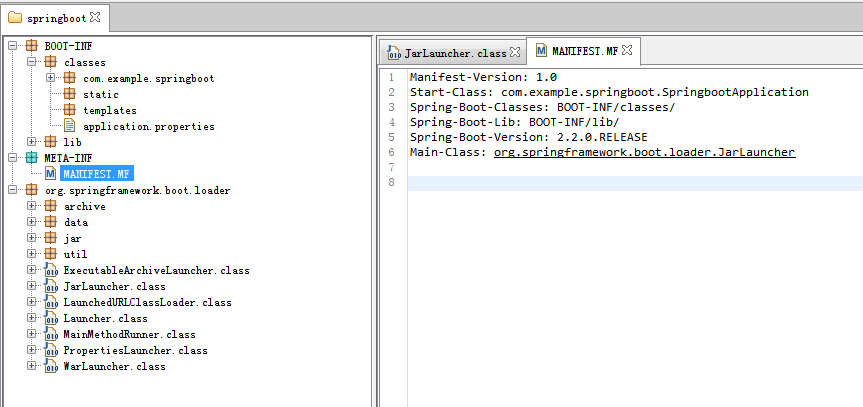

## Springboot打成jar包后的启动流程分析 ##
> springboot项目打成jar包之后，为何直接通过在命令行中输入“java -jar 项目名称.jar"命令就可以启动整个项目呢？

1. 我们先来看看springboot项目打成jar包之后的整体目录结构



**jar包目录结构说明**

		-- BOOT-INF
			-- classes (存放的是项目编译后的所有的文件包括资源配置文件以及class文件)
			-- lib (目录是该项目所有依赖的第三方的jar包)
		-- META-INF
			-- MANIFEST.MF （存放的项目清单，是动态被创建出来的，包含了启动类、项目版本号等）
		-- org
			-- springframework
				-- boot
					-- loader (将spring-boot-loader.jar包中的内容复制到了jar包中的顶层目录中)

**在命令行中执行“java -jar springboot.jar”时，到底执行了什么？**
	
	在命令行输入该命令时，应用类加载器会从MANIFEST.MF文件中加载Main-Class属性对应的值
	(org.springframework.boot.loader.JarLauncher),然后执行其中的main方法，
	在执行该main方法时，springboot会创建自己的类加载器，
	然后从MANIFEST.MF文件中获取Start-Class属性对应的值，
	然后根据当前线程上下文中的类加载器从BOOT-INF/classes中
	加载com.example.springboot.SpringbootApplication类，
	以及从BOOT-INF/lib目录下加载依赖的第三方类
	

**关于manifest详细说明参考如下链接**

[https://www.cnblogs.com/applerosa/p/9736729.html](https://www.cnblogs.com/applerosa/p/9736729.html)

## jar包执行类：JarLauncher源码 ##

在命令行中执行“java -jar springboot.jar”时，会执行JarLauncher中的main方法
```java
/**
* Launcher基于归档的jar文件，这个启动器假定它依赖的jar包是在“BOOT-INF/lib”目录下，
* 应用程序类文件是在“BOOF-INF/classes”目录下，该类继承自ExecutableArchiveLauncher类
*/
public class JarLauncher extends ExecutableArchiveLauncher {

	static final String BOOT_INF_CLASSES = "BOOT-INF/classes/";
	static final String BOOT_INF_LIB = "BOOT-INF/lib/";

	public JarLauncher() {
	}

	protected JarLauncher(Archive archive) {
		super(archive);
	}

	@Override
	protected boolean isNestedArchive(Archive.Entry entry) {
		if (entry.isDirectory()) {
			return entry.getName().equals(BOOT_INF_CLASSES);
		}
		return entry.getName().startsWith(BOOT_INF_LIB);
	}

	public static void main(String[] args) throws Exception {
		new JarLauncher().launch(args);
	}

}
```
main函数中，实例化JarLauncher，然后调用父类Launcher中的launch方法
```java
/**
* 是启动器的父类，它可以启动一个应用程序使用一个完全已配置好的类路径，通过一个或多个的归档文件
*/
public abstract class Launcher {
	
	/**
	* 启动一个应用程序，这个方法是初始的入口点，
	* 可以被子类中的“public static void main(String[] args)”方法所调用
	*/
	protected void launch(String[] args) throws Exception {
		JarFile.registerUrlProtocolHandler();
		// 根据从classpath目录下获取的归档类集合，来创建一个自定义类加载器
		ClassLoader classLoader = createClassLoader(getClassPathArchives());
		// getMainClass():从manifest文件中获取属性为Start-Class对应的值
		launch(args, getMainClass(), classLoader);
	}
	
	/**
	 * 为指定的归档类集合创建一个来加载器
	 */
	protected ClassLoader createClassLoader(List<Archive> archives) throws Exception {
		List<URL> urls = new ArrayList<>(archives.size());
		for (Archive archive : archives) {
			urls.add(archive.getUrl());
		}
		return createClassLoader(urls.toArray(new URL[0]));
	}

	/**
	 * Create a classloader for the specified URLs.
	 * 根据指定的URL集合(该url是在服务器上的绝对路径)，
	 * 创建一个类加载器LaunchedURLClassLoader
	 */
	protected ClassLoader createClassLoader(URL[] urls) throws Exception {
		// 将当前启动器类的类加载作为父加载器（当前启动器类的加载器是应用类加载器）来创建自定义类加载器
		return new LaunchedURLClassLoader(urls, getClass().getClassLoader());
	}

	/**
	 * Returns the main class that should be launched.
	 * 从manifest文件中获取属性为Start-Class对应的值
	 * Start-Class: com.example.springboot.SpringbootApplication
	 */
	protected abstract String getMainClass() throws Exception;

	/**
	 * 根据给定的归档类文件和完全已配置好的类加载器来启动一个应用程序
	 * @param args 输入的参数
	 * @param mainClass 从manifest中获取Start-Class属性的值(com.example.springboot.SpringbootApplication)
	 * @param classLoader 该类加载器用于加载从manifest中获取Start-Class属性的值
	 * @throws Exception if the launch fails
	 */
	protected void launch(String[] args, String mainClass, ClassLoader classLoader) throws Exception {
		// 将类加载器设置到当前线程的上线文加载器中
		Thread.currentThread().setContextClassLoader(classLoader);
		// 创建一个主函数的运行期
		createMainMethodRunner(mainClass, args, classLoader).run();
	}

	/**
	 * 创建MainMethodRunner的实例用于启动应用程序
	 */
	protected MainMethodRunner createMainMethodRunner(String mainClass, String[] args, ClassLoader classLoader) {
		return new MainMethodRunner(mainClass, args);
	}
}
```
接下来我们分析launch(String[] args)方法
```java
/**
 * 返回一个归档类的集合，可以用于构造一个类路径，
 * 这个是一个抽象方法，交由子类(ExecutableArchiveLauncher)实现
 */
protected abstract List<Archive> getClassPathArchives() throws Exception;
```
Launcher的子类ExecutableArchiveLauncher实现了getClassPathArchives方法
```java
/**
* 为可执行(JarLauncher)归档类的父类
*/
public abstract class ExecutableArchiveLauncher extends Launcher {
	@Override
	protected String getMainClass() throws Exception {
		Manifest manifest = this.archive.getManifest();
		String mainClass = null;
		if (manifest != null) {
			mainClass = manifest.getMainAttributes().getValue("Start-Class");
		}
		if (mainClass == null) {
			throw new IllegalStateException("No 'Start-Class' manifest entry specified in " + this);
		}
		return mainClass;
	}
	
	@Override
	protected List<Archive> getClassPathArchives() throws Exception {
		List<Archive> archives = new ArrayList<>(this.archive.getNestedArchives(this::isNestedArchive));
		postProcessClassPathArchives(archives);
		return archives;
	}

	/**
	 * 确定指定的JarEntry是否为嵌套项，可以被添加到classpath下，该方法会被每个entry调用一次
	 * 该方法是一个抽象方法，最终会调用JarLauncher中的isNestedArchive方法
	 */
	protected abstract boolean isNestedArchive(Archive.Entry entry);
	
	/**
	 * 此方法没有任何处理，可以不用考虑
	 */
	protected void postProcessClassPathArchives(List<Archive> archives) throws Exception {
	}
}
```
Archive是一个接口，最终会调用实现类JarFileArchive中的getNestedArchives
```java
/**
 * 一个归档类可以被启动器中的启动，该类是一个接口，
 * 由对应的实现类(JarFileArchive 和 ExplodedArchive)去实现
 */
public interface Archive extends Iterable<Archive.Entry>, AutoCloseable {
	/**
	 * 返回一个嵌套的归档类集合，通过匹配特定的过滤器
	 */
	List<Archive> getNestedArchives(EntryFilter filter) throws IOException;
}
```
JarFileArchive类中的部分源码
```java
public class JarFileArchive implements Archive {
	
	/**
	* 返回一个归档类集合，根据filter过滤器，来匹配对应的entry
	*/
	@Override
	public List<Archive> getNestedArchives(EntryFilter filter) throws IOException {
		List<Archive> nestedArchives = new ArrayList<>();
		for (Entry entry : this) {
			if (filter.matches(entry)) {
				nestedArchives.add(getNestedArchive(entry));
			}
		}
		return Collections.unmodifiableList(nestedArchives);
	}

	protected Archive getNestedArchive(Entry entry) throws IOException {
		JarEntry jarEntry = ((JarFileEntry) entry).getJarEntry();
		if (jarEntry.getComment().startsWith(UNPACK_MARKER)) {
			return getUnpackedNestedArchive(jarEntry);
		}
		try {
			JarFile jarFile = this.jarFile.getNestedJarFile(jarEntry);
			return new JarFileArchive(jarFile);
		}
		catch (Exception ex) {
			throw new IllegalStateException("Failed to get nested archive for entry " + entry.getName(), ex);
		}
	}
}
```
辅助类“MainMethodRunner”
```
/**
 * 辅助类，被用于启动类去调用main方法，该启动器类包含一个main方法，使用线程上下文类加载器加载
 */
public class MainMethodRunner {

	private final String mainClassName;

	private final String[] args;

	/**
	 * Create a new {@link MainMethodRunner} instance.
	 * @param mainClass the main class
	 * @param args incoming arguments
	 */
	public MainMethodRunner(String mainClass, String[] args) {
		this.mainClassName = mainClass;
		this.args = (args != null) ? args.clone() : null;
	}
	
	/**
	* 通过反射的方式去调用SpringbootApplication类中的main方法
	*/
	public void run() throws Exception {
		Class<?> mainClass = Thread.currentThread().getContextClassLoader().loadClass(this.mainClassName);
		Method mainMethod = mainClass.getDeclaredMethod("main", String[].class);
		mainMethod.invoke(null, new Object[] { this.args });
	}

}
```
最后，在MainMethodRunner类中会调用run方法，先获取当前线程的上线文类加载器，然后使用该类加载器将“com.example.springboot.SpringbootApplication”启动类来进行加载，然后以反射的方式获取启动类中的main方法，最终执行该main方法进行启动。