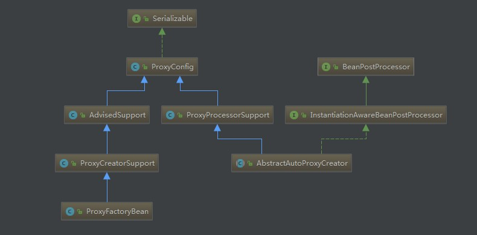

## Spring AOP
> Spring AOP的实现是基于代理的机制，默认采用JDK Dynamic Proxy，也可以采用cglib的Proxy。**两者的区别**：主要是在于被代理的对象的不同。当目标对象是接口时，JDK Dynamic Proxy可以完成代理，但目标对象没有实现接口的类时，采用的是cglib proxy来完成代理。当然也可以强制接口采用cglib来代理，另外需要注入或引用具体类型时，如果引用的东西恰恰是代理过的对象，此时也需要采用cglib的方式。

**Spring AOP类图结构**


功能设计和实现上来可以分为两大块
1. aop基础设施的创建，可以看作是aopProxy的生成
2. aopProxy对象的调用时的处理拦截，即处理对目标对象的拦截器

#### AOP的创建
1. 生成代理对象的核心类，**ProxyFactoryBean.getObject()**
```java
/**
 * Return a proxy. Invoked when clients obtain beans from this factory bean.
 * Create an instance of the AOP proxy to be returned by this factory.
 * The instance will be cached for a singleton, and create on each call to
 * {@code getObject()} for a proxy.
 * @return a fresh AOP proxy reflecting the current state of this factory
 */
@Override
public Object getObject() throws BeansException {
	initializeAdvisorChain();
	if (isSingleton()) {
		return getSingletonInstance();
	}
	else {
		if (this.targetName == null) {
			logger.warn("Using non-singleton proxies with singleton targets is often undesirable. " +
					"Enable prototype proxies by setting the 'targetName' property.");
		}
		return newPrototypeInstance();
	}
}
```
2. 生成代理时，是选择JDK Dynamic Proxy还是cglib Proxy的核心逻辑：**DefaultAopProxyFactory.createAopProxy(AdvisedSupport config)**
```java
@Override
public AopProxy createAopProxy(AdvisedSupport config) throws AopConfigException {
	if (config.isOptimize() || config.isProxyTargetClass() || hasNoUserSuppliedProxyInterfaces(config)) {
		Class<?> targetClass = config.getTargetClass();
		if (targetClass == null) {
			throw new AopConfigException("TargetSource cannot determine target class: " +
					"Either an interface or a target is required for proxy creation.");
		}
		if (targetClass.isInterface() || Proxy.isProxyClass(targetClass)) {
			return new JdkDynamicAopProxy(config);
		}
		return new ObjenesisCglibAopProxy(config);
	}
	else {
		return new JdkDynamicAopProxy(config);
	}
}
```
> createAopProxy方法生成代理对象的真正执行者，那么此操作是在何时被调用的呢？又是如何把最终被代理的对象交给IOC的呢？从Spring Bean的生命周期发现，Bean在被创建的时候，有一系列的回调接口供用户自定义实现，来更改Bean的一些特性，其中**BeanPostProcessor**接口就是其中一种，SpringAOP就是通过实现该接口，如果正在创建的Bean是AOP的target(被代理的目标对象)，则创建代理，并把最终的被代理的对象返回给Ioc容器进行管理。

&emsp;从上面类图结构看到，**AbstractAutoProxyCreator**这个类是一个**BeanPostProcessor**接口的实现，用来创建代理对象，在**AbstractAutoProxyCreator.postProcessBeforeInstantiation**方法中，最终返回了createProxy()方法返回的代理。
```java
@Override
public Object postProcessBeforeInstantiation(Class<?> beanClass, String beanName) throws BeansException {
	Object cacheKey = getCacheKey(beanClass, beanName);
	if (beanName == null || !this.targetSourcedBeans.contains(beanName)) {
		if (this.advisedBeans.containsKey(cacheKey)) {
			return null;
		}
		if (isInfrastructureClass(beanClass) || shouldSkip(beanClass, beanName)) {
			this.advisedBeans.put(cacheKey, Boolean.FALSE);
			return null;
		}
	}
	// Create proxy here if we have a custom TargetSource.
	// Suppresses unnecessary default instantiation of the target bean:
	// The TargetSource will handle target instances in a custom fashion.
	if (beanName != null) {
		TargetSource targetSource = getCustomTargetSource(beanClass, beanName);
		if (targetSource != null) {
			this.targetSourcedBeans.add(beanName);
			Object[] specificInterceptors = getAdvicesAndAdvisorsForBean(beanClass, beanName, targetSource);
			Object proxy = createProxy(beanClass, beanName, specificInterceptors, targetSource);
			this.proxyTypes.put(cacheKey, proxy.getClass());
			return proxy;
		}
	}
	return null;
}
```
```java
/**
 * Create an AOP proxy for the given bean.
 * @param beanClass the class of the bean
 * @param beanName the name of the bean
 * @param specificInterceptors the set of interceptors that is
 * specific to this bean (may be empty, but not null)
 * @param targetSource the TargetSource for the proxy,
 * already pre-configured to access the bean
 * @return the AOP proxy for the bean
 * @see #buildAdvisors
 */
protected Object createProxy(
		Class<?> beanClass, String beanName, Object[] specificInterceptors, TargetSource targetSource) {
	if (this.beanFactory instanceof ConfigurableListableBeanFactory) {
		AutoProxyUtils.exposeTargetClass((ConfigurableListableBeanFactory) this.beanFactory, beanName, beanClass);
	}
	ProxyFactory proxyFactory = new ProxyFactory();
	proxyFactory.copyFrom(this);
	if (!proxyFactory.isProxyTargetClass()) {
		if (shouldProxyTargetClass(beanClass, beanName)) {
			proxyFactory.setProxyTargetClass(true);
		}
		else {
			evaluateProxyInterfaces(beanClass, proxyFactory);
		}
	}
	Advisor[] advisors = buildAdvisors(beanName, specificInterceptors);
	proxyFactory.addAdvisors(advisors);
	proxyFactory.setTargetSource(targetSource);
	customizeProxyFactory(proxyFactory);

	proxyFactory.setFrozen(this.freezeProxy);
	if (advisorsPreFiltered()) {
		proxyFactory.setPreFiltered(true);
	}
	return proxyFactory.getProxy(getProxyClassLoader());
}
```

#### AOP切面的增强的执行
> 可以理解成对目标对象上所有拦截器链的调用

由于Spring AOP的代理方式的实现有两种：**JDK的动态代理(JDK Dynamic Proxy)** 和**CGLIB代理(CGLIB Proxy)**，在执行拦截器的方式有所不同，
J**DK的动态代理实现了InvocationHandler接口中的invoke()方法**，源码如下：
```java
/**
 * Implementation of {@code InvocationHandler.invoke}.
 * <p>Callers will see exactly the exception thrown by the target,
 * unless a hook method throws an exception.
 */
@Override
public Object invoke(Object proxy, Method method, Object[] args) throws Throwable {
	MethodInvocation invocation;
	Object oldProxy = null;
	boolean setProxyContext = false;

	TargetSource targetSource = this.advised.targetSource;
	Class<?> targetClass = null;
	Object target = null;

	try {
		if (!this.equalsDefined && AopUtils.isEqualsMethod(method)) {
			// The target does not implement the equals(Object) method itself.
			return equals(args[0]);
		}
		else if (!this.hashCodeDefined && AopUtils.isHashCodeMethod(method)) {
			// The target does not implement the hashCode() method itself.
			return hashCode();
		}
		else if (method.getDeclaringClass() == DecoratingProxy.class) {
			// There is only getDecoratedClass() declared -> dispatch to proxy config.
			return AopProxyUtils.ultimateTargetClass(this.advised);
		}
		else if (!this.advised.opaque && method.getDeclaringClass().isInterface() &&
				method.getDeclaringClass().isAssignableFrom(Advised.class)) {
			// Service invocations on ProxyConfig with the proxy config...
			return AopUtils.invokeJoinpointUsingReflection(this.advised, method, args);
		}

		Object retVal;

		if (this.advised.exposeProxy) {
			// Make invocation available if necessary.
			oldProxy = AopContext.setCurrentProxy(proxy);
			setProxyContext = true;
		}

		// May be null. Get as late as possible to minimize the time we "own" the target,
		// in case it comes from a pool.
		target = targetSource.getTarget();
		if (target != null) {
			targetClass = target.getClass();
		}

		// Get the interception chain for this method.
		List<Object> chain = this.advised.getInterceptorsAndDynamicInterceptionAdvice(method, targetClass);

		// Check whether we have any advice. If we don't, we can fallback on direct
		// reflective invocation of the target, and avoid creating a MethodInvocation.
		if (chain.isEmpty()) {
			// We can skip creating a MethodInvocation: just invoke the target directly
			// Note that the final invoker must be an InvokerInterceptor so we know it does
			// nothing but a reflective operation on the target, and no hot swapping or fancy proxying.
			Object[] argsToUse = AopProxyUtils.adaptArgumentsIfNecessary(method, args);
			retVal = AopUtils.invokeJoinpointUsingReflection(target, method, argsToUse);
		}
		else {
			// We need to create a method invocation...
			invocation = new ReflectiveMethodInvocation(proxy, target, method, args, targetClass, chain);
			// Proceed to the joinpoint through the interceptor chain.
			retVal = invocation.proceed();
		}

		// Massage return value if necessary.
		Class<?> returnType = method.getReturnType();
		if (retVal != null && retVal == target &&
				returnType != Object.class && returnType.isInstance(proxy) &&
				!RawTargetAccess.class.isAssignableFrom(method.getDeclaringClass())) {
			// Special case: it returned "this" and the return type of the method
			// is type-compatible. Note that we can't help if the target sets
			// a reference to itself in another returned object.
			retVal = proxy;
		}
		else if (retVal == null && returnType != Void.TYPE && returnType.isPrimitive()) {
			throw new AopInvocationException(
					"Null return value from advice does not match primitive return type for: " + method);
		}
		return retVal;
	}
	finally {
		if (target != null && !targetSource.isStatic()) {
			// Must have come from TargetSource.
			targetSource.releaseTarget(target);
		}
		if (setProxyContext) {
			// Restore old proxy.
			AopContext.setCurrentProxy(oldProxy);
		}
	}
}
```
对目标方法的调用最终是依靠ReflectiveMethodInvocation。
ReflectiveMethodInvocation中的proceed处理是采用递归的方式处理拦截器链
```java
@Override
public Object proceed() throws Throwable {
	//	We start with an index of -1 and increment early.
	if (this.currentInterceptorIndex == this.interceptorsAndDynamicMethodMatchers.size() - 1) {
		return invokeJoinpoint();
	}

	Object interceptorOrInterceptionAdvice =
			this.interceptorsAndDynamicMethodMatchers.get(++this.currentInterceptorIndex);
	if (interceptorOrInterceptionAdvice instanceof InterceptorAndDynamicMethodMatcher) {
		// Evaluate dynamic method matcher here: static part will already have
		// been evaluated and found to match.
		InterceptorAndDynamicMethodMatcher dm =
				(InterceptorAndDynamicMethodMatcher) interceptorOrInterceptionAdvice;
		if (dm.methodMatcher.matches(this.method, this.targetClass, this.arguments)) {
			return dm.interceptor.invoke(this);
		}
		else {
			// Dynamic matching failed.
			// Skip this interceptor and invoke the next in the chain.
			return proceed();
		}
	}
	else {
		// It's an interceptor, so we just invoke it: The pointcut will have
		// been evaluated statically before this object was constructed.
		return ((MethodInterceptor) interceptorOrInterceptionAdvice).invoke(this);
	}
}
```

CGLIB代理的核心类：cglibAopProxy.getProxy()方法
```java
@Override
public Object getProxy(ClassLoader classLoader) {
	
	try {
		// 此处代码省略
		Callback[] callbacks = getCallbacks(rootClass);
		Class<?>[] types = new Class<?>[callbacks.length];
		for (int x = 0; x < types.length; x++) {
			types[x] = callbacks[x].getClass();
		}
		// fixedInterceptorMap only populated at this point, after getCallbacks call above
		enhancer.setCallbackFilter(new ProxyCallbackFilter(
				this.advised.getConfigurationOnlyCopy(), this.fixedInterceptorMap, this.fixedInterceptorOffset));
		enhancer.setCallbackTypes(types);

		// Generate the proxy class and create a proxy instance.
		return createProxyClassAndInstance(enhancer, callbacks);
	}
	// 此处代码省略
}
```
最终通过实现MethodInterceptor接口的intercept方法，来实现对目标方法拦截
```java
@Override
public Object intercept(Object proxy, Method method, Object[] args, MethodProxy methodProxy) throws Throwable {
	Object oldProxy = null;
	boolean setProxyContext = false;
	Class<?> targetClass = null;
	Object target = null;
	try {
		// 此处代码省略
		target = getTarget();
		if (target != null) {
			targetClass = target.getClass();
		}
		List<Object> chain = this.advised.getInterceptorsAndDynamicInterceptionAdvice(method, targetClass);
		Object retVal;
		// 此处代码省略
		if (chain.isEmpty() && Modifier.isPublic(method.getModifiers())) {
			// 此处代码省略
			Object[] argsToUse = AopProxyUtils.adaptArgumentsIfNecessary(method, args);
			retVal = methodProxy.invoke(target, argsToUse);
		}
		else {
			// We need to create a method invocation...
			retVal = new CglibMethodInvocation(proxy, target, method, args, targetClass, chain, methodProxy).proceed();
		}
		retVal = processReturnType(proxy, target, method, retVal);
		return retVal;
	}
	// 此处代码省略
}
```
CglibMethodInvocation继承了ReflectiveMethodInvocation，所以在处理拦截器链时也是用的JDK Dynamic Proxy一样的proceed()方法

#### <font color=red>注意点</font>
在使用Spring AOP时需要注意的两点：
1. 在类的内部，方法之间的调用时(self-invoke)，Spring AOP是不起作用的，原因是内部调用时没有通过代理对象，直接使用的目标对象。解决方案有：
	1. 重构代码，避免内部调用
	2. AopContext.currentProxy()
	3. 或者使用AspectJ

2. 在注入bean时，如果想注入bean的具体类型而不是接口，那就采用cglib

#### 参考
[Spring AOP模块概述](https://mp.weixin.qq.com/s/XkSpuDCrx3nWSOBhQqAm9g)