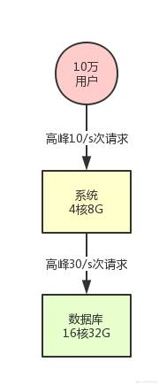
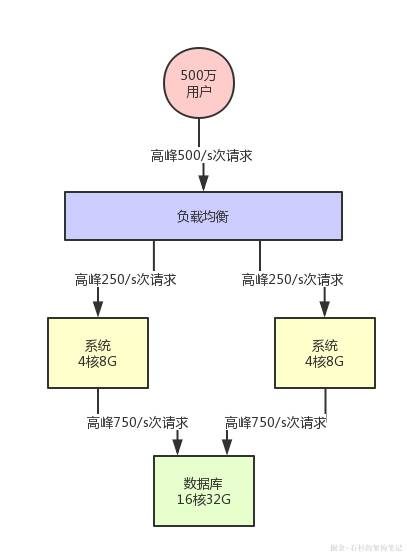
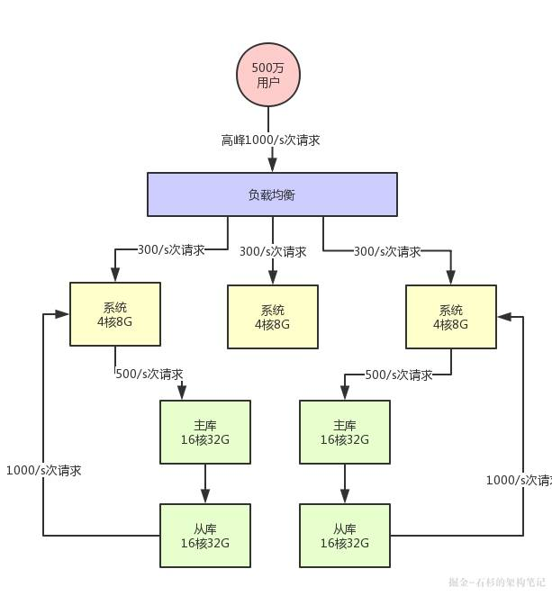
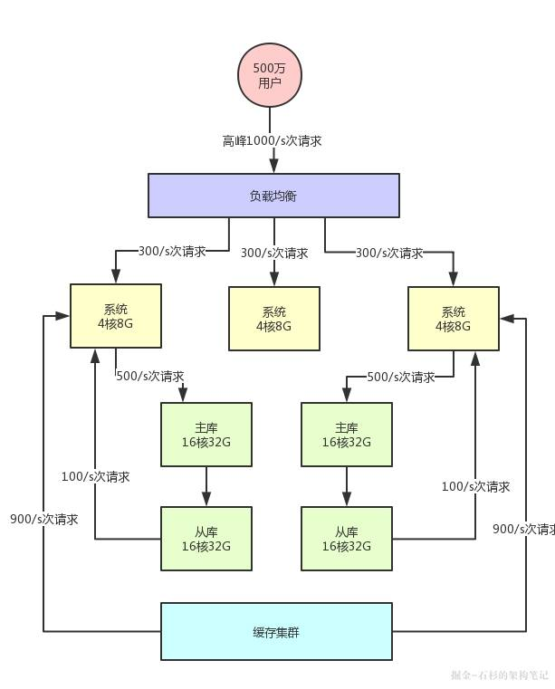
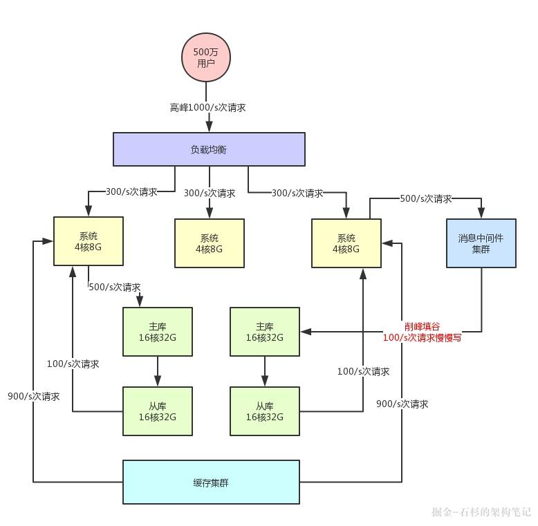

## 1、一道面试题的背景引入 ##
这篇文章，我们聊聊大量同学问我的一个问题，面试的时候被问到一个让人特别手足无措的问题：你的系统如何支撑高并发？
大多数同学被问到这个问题压根儿没什么思路去回答，不知道从什么地方说起，其实本质就是没经历过一些真正有高并发系统的锤炼罢了。

因为没有过相关的项目经历，所以就没法从真实的自身体会和经验中提炼出一套回答，然后系统的阐述出来自己复杂过的系统如何支撑高并发的。

所以，这篇文章就从这个角度切入来简单说说这个问题，用一个最简单的思路来回答，大致如何应对。
当然这里首先说清楚一个前提：高并发系统各不相同。比如每秒百万并发的中间件系统、每日百亿请求的网关系统、瞬时每秒几十万请求的秒杀大促系统。

他们在应对高并发的时候，因为系统各自自身特点的不同，所以应对架构都是不一样的。
另外，比如电商平台中的订单系统、商品系统、库存系统，在高并发场景下的架构设计也是不同的，因为背后的业务场景什么的都不一样。

所以，这篇文章主要是给大家提供一个回答这类问题的思路，不涉及任何复杂架构设计，让你不至于在面试中被问到这个问题时，跟面试官大眼瞪小眼。

具体要真能在面试的时候回答好这个问题，建议各位参考一下本文思路，然后对你自己手头负责的系统多去思考一下，最好做一些相关的架构实践。

## 先考虑一个最简单的系统架构 ##
假设刚刚开始你的系统就部署在一台机器上，背后就连接了一台数据库，数据库部署在一台服务器上。
我们甚至可以再现实点，给个例子，你的系统部署的机器是4核8G，数据库服务器是16核32G。

此时假设你的系统用户量总共就10万，用户量很少，日活用户按照不同系统的场景有区别，我们取一个较为客观的比例，10%吧，每天活跃的用户就1万。

按照28法则，每天高峰期算他4个小时，高峰期活跃的用户占比达到80%，就是8000人活跃在4小时内。

然后每个人对你的系统发起的请求，我们算他每天是20次吧。那么高峰期8000人发起的请求也才16万次，平均到4小时内的每秒（14400秒），每秒也就10次请求。

好吧！完全跟高并发搭不上边，对不对？

然后系统层面每秒是10次请求，对数据库的调用每次请求都会好几次数据库操作的，比如做做crud之类的。

那么我们取一个一次请求对应3次数据库请求吧，那这样的话，数据库层每秒也就30次请求，对不对？

按照这台数据库服务器的配置，支撑是绝对没问题的。

上述描述的系统，用一张图表示，就是下面这样：

## 系统集群化部署 ##
假设此时你的用户数开始快速增长，比如注册用户量增长了50倍，上升到了500万。

此时日活用户是50万，高峰期对系统每秒请求是500/s。然后对数据库的每秒请求数量是1500/s，这个时候会怎么样呢？

按照上述的机器配置来说，如果你的系统内处理的是较为复杂的一些业务逻辑，是那种重业务逻辑的系统的话，是比较耗费CPU的。
此时，4核8G的机器每秒请求达到500/s的时候，很可能你会发现你的机器CPU负载较高了。

然后数据库层面，以上述的配置而言，其实基本上1500/s的高峰请求压力的话，还算可以接受。

这个主要是要观察数据库所在机器的磁盘负载、网络负载、CPU负载、内存负载，按照我们的线上经验而言，那个配置的数据库在1500/s请求压力下是没问题的。

所以此时你需要做的一个事情，首先就是要支持你的系统集群化部署。

你可以在前面挂一个负载均衡层，把请求均匀打到系统层面，让系统可以用多台机器集群化支撑更高的并发压力。

比如说这里假设给系统增加部署一台机器，那么每台机器就只有250/s的请求了。

这样一来，两台机器的CPU负载都会明显降低，这个初步的“高并发”不就先cover住了吗？

要是连这个都不做，那单台机器负载越来越高的时候，极端情况下是可能出现机器上部署的系统无法有足够的资源响应请求了，然后出现请求卡死，甚至系统宕机之类的问题。

所以，简单小结，第一步要做的：

添加负载均衡层，将请求均匀打到系统层。
系统层采用集群化部署多台机器，扛住初步的并发压力。

此时的架构图变成下面的样子：

## 数据库分库分表 + 读写分离 ##
假设此时用户量继续增长，达到了1000万注册用户，然后每天日活用户是100万。

那么此时对系统层面的请求量会达到每秒1000/s，系统层面，你可以继续通过集群化的方式来扩容，反正前面的负载均衡层会均匀分散流量过去的。

但是，这时数据库层面接受的请求量会达到3000/s，这个就有点问题了。

此时数据库层面的并发请求翻了一倍，你一定会发现线上的数据库负载越来越高。

每次到了高峰期，磁盘IO、网络IO、内存消耗、CPU负载的压力都会很高，大家很担心数据库服务器能否抗住。

没错，一般来说，对那种普通配置的线上数据库，建议就是读写并发加起来，按照上述我们举例的那个配置，不要超过3000/s。

因为数据库压力过大，首先一个问题就是高峰期系统性能可能会降低，因为数据库负载过高对性能会有影响。

另外一个，压力过大把你的数据库给搞挂了怎么办？

所以此时你必须得对系统做分库分表 + 读写分离，也就是把一个库拆分为多个库，部署在多个数据库服务上，这是作为主库承载写入请求的。

然后每个主库都挂载至少一个从库，由从库来承载读请求。

此时假设对数据库层面的读写并发是3000/s，其中写并发占到了1000/s，读并发占到了2000/s。

那么一旦分库分表之后，采用两台数据库服务器上部署主库来支撑写请求，每台服务器承载的写并发就是500/s。每台主库挂载一个服务器部署从库，那么2个从库每个从库支撑的读并发就是1000/s。

简单总结，并发量继续增长时，我们就需要focus在数据库层面：分库分表、读写分离。

此时的架构图如下所示：

## 缓存集群引入 ##

接着就好办了，如果你的注册用户量越来越大，此时你可以不停的加机器，比如说系统层面不停加机器，就可以承载更高的并发请求。

然后数据库层面如果写入并发越来越高，就扩容加数据库服务器，通过分库分表是可以支持扩容机器的，如果数据库层面的读并发越来越高，就扩容加更多的从库。

但是这里有一个很大的问题：数据库其实本身不是用来承载高并发请求的，所以通常来说，数据库单机每秒承载的并发就在几千的数量级，而且数据库使用的机器都是比较高配置，比较昂贵的机器，成本很高。

如果你就是简单的不停的加机器，其实是不对的。

所以在高并发架构里通常都有缓存这个环节，缓存系统的设计就是为了承载高并发而生。

所以单机承载的并发量都在每秒几万，甚至每秒数十万，对高并发的承载能力比数据库系统要高出一到两个数量级。

所以你完全可以根据系统的业务特性，对那种写少读多的请求，引入缓存集群。

具体来说，就是在写数据库的时候同时写一份数据到缓存集群里，然后用缓存集群来承载大部分的读请求。

这样的话，通过缓存集群，就可以用更少的机器资源承载更高的并发。

比如说上面那个图里，读请求目前是每秒2000/s，两个从库各自抗了1000/s读请求，但是其中可能每秒1800次的读请求都是可以直接读缓存里的不怎么变化的数据的。

那么此时你一旦引入缓存集群，就可以抗下来这1800/s读请求，落到数据库层面的读请求就200/s。

同样，给大家来一张架构图，一起来感受一下：

按照上述架构，他的好处是什么呢？

可能未来你的系统读请求每秒都几万次了，但是可能80%~90%都是通过缓存集群来读的，而缓存集群里的机器可能单机每秒都可以支撑几万读请求，所以耗费机器资源很少，可能就两三台机器就够了。

你要是换成是数据库来试一下，可能就要不停的加从库到10台、20台机器才能抗住每秒几万的读并发，那个成本是极高的。

好了，我们再来简单小结，承载高并发需要考虑的第三个点：

不要盲目进行数据库扩容，数据库服务器成本昂贵，且本身就不是用来承载高并发的 针对写少读多的请求，引入缓存集群，用缓存集群抗住大量的读请求

## 引入消息中间件集群 ##

接着再来看看数据库写这块的压力，其实是跟读类似的。

假如说你所有写请求全部都落地数据库的主库层，当然是没问题的，但是写压力要是越来越大了呢？

比如每秒要写几万条数据，此时难道也是不停的给主库加机器吗？

可以当然也可以，但是同理，你耗费的机器资源是很大的，这个就是数据库系统的特点所决定的。

相同的资源下，数据库系统太重太复杂，所以并发承载能力就在几千/s的量级，所以此时你需要引入别的一些技术。

比如说消息中间件技术，也就是MQ集群，他是非常好的做写请求异步化处理，实现削峰填谷的效果。

假如说，你现在每秒是1000/s次写请求，其中比如500次请求是必须请求过来立马写入数据库中的，但是另外500次写请求是可以允许异步化等待个几十秒，甚至几分钟后才落入数据库内的。

那么此时你完全可以引入消息中间件集群，把允许异步化的每秒500次请求写入MQ，然后基于MQ做一个削峰填谷。比如就以平稳的100/s的速度消费出来然后落入数据库中即可，此时就会大幅度降低数据库的写入压力。

ps：关于MQ削峰填谷的概念，在公众号之前讲消息中间件的文章中已详细阐述，如果大伙儿忘记了，可以回顾一下。
此时，架构图变成了下面这样：

大家看上面的架构图，首先消息中间件系统本身也是为高并发而生，所以通常单机都是支撑几万甚至十万级的并发请求的。
所以，他本身也跟缓存系统一样，可以用很少的资源支撑很高的并发请求，用他来支撑部分允许异步化的高并发写入是没问题的，比使用数据库直接支撑那部分高并发请求要减少很多的机器使用量。

而且经过消息中间件的削峰填谷之后，比如就用稳定的100/s的速度写数据库，那么数据库层面接收的写请求压力，不就成了500/s + 100/s = 600/s了么？

大家看看，是不是发现减轻了数据库的压力？

到目前为止，通过下面的手段，我们已经可以让系统架构尽可能用最小的机器资源抗住了最大的请求压力，减轻了数据库的负担。
系统集群化

数据库层面的分库分表+读写分离

针对读多写少的请求，引入缓存集群

针对高写入的压力，引入消息中间件集群，

## 转载至 ##
作者：石杉的架构笔记

链接：[https://juejin.im/post/5c45aaee6fb9a049e6609115](https://juejin.im/post/5c45aaee6fb9a049e6609115)

